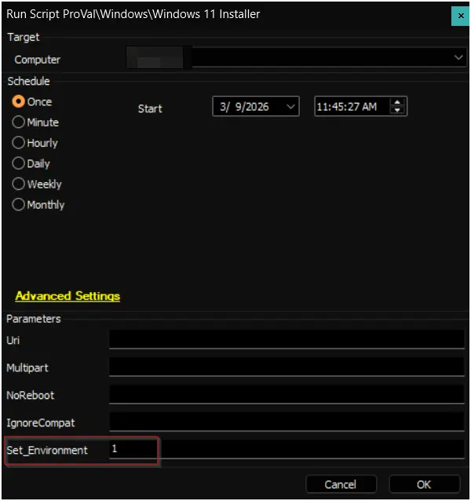
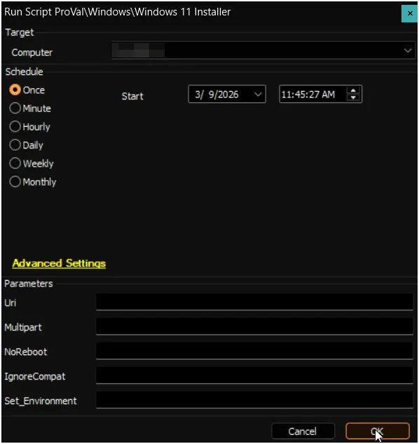
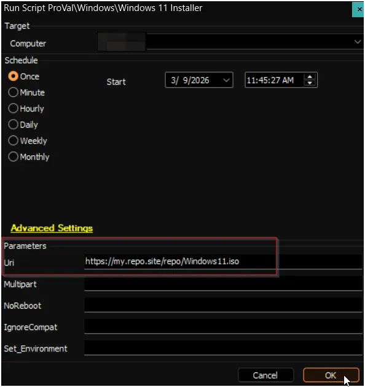

## Summary

Designed to upgrade Windows systems to the latest version. It can be used to:

- Upgrade Windows 10 to Windows 11
- Install Windows 11 feature updates (e.g., 21H2 → 22H2 → 23H2 → 24H2 → 25H2)

Supports multiple source types including HTTP/HTTPS URLs, local files, and network shares (UNC paths).

Download URL: [https://file.provaltech.com/repo/app/windows-upgrader.exe](https://file.provaltech.com/repo/app/windows-upgrader.exe)  

## File Hash
- **File Path**: `C:\ProgramData\_automation\app\windows-upgrader\windows-upgrader.exe`  
- **File Hash (SHA256)**: `54AF67BF1D9F862F0E91D2591EE2033074EF6151F2BB43E74292235BBF99BCC4`  
- **File Hash (MD5)**: `DCF1763E3DED1B4AA04F97511EE5A2E2`  

------

- **File Path**: `C:\ProgramData\_automation\app\windows-upgrader\Check-ReservedPartition.ps1`  
- **File Hash (SHA256)**: `DC034BC8A20D8E8CB41D5B737F1E31FC858C57385DE668369BAA825D470C9450`  
- **File Hash (MD5)**: `4A51DD45AB4E85DDFCA33D2F98875C7F`  

> **Notes:**  
> • If the script is run without the **NoReboot** flag, it will automatically schedule itself to run again 30 minutes after the upgrade completes to perform validation.  
> • The **Version** and **Uri** parameters should not be used simultaneously. If both are provided, **Uri** will override **Version**.  
> • If no parameters are supplied, the machine will be upgraded to **24H2** by default.  
> • The **Version** parameter can be set to **24H2** or **25H2**, depending on your requirement.  
> • When using the **Version** parameter, you do not need to host an ISO or ZIP file or supply the **Uri**.

## Update Notices

### Update Notice: 8 December, 2025

- Introduce a new parameter `Version`
- Currently supported versions are `24H2` and `25H2`

### Update Notice: 3 November, 2025

- Updated to support Windows 11
- Updated to support UNC path
- Updated to support Azure Blob Storage URLs with SAS tokens (must be a direct download URL)

### Update Notice: 8 October, 2025

- The script has been updated to support local paths in the URI.
- It now removes the installers and extracted files before running the installation.

### Update Notice: 15 January, 2025

The script has been updated to address the `InsufficientSystemPartitionDiskSpaceHardblock` issue.

- **Reference**: [InsufficientSystemPartitionDiskSpaceHardblock](https://support.microsoft.com/en-us/help/3086249/-we-couldn-t-update-system-reserved-partition-error-installing-windows)  
- **Acknowledgment:** `Hunter Line (Aptica, LLC) for their valuable contributions.`

## Sample Run

### Example 1: Install Windows 11 24H2

### Example 2: Install Windows 11 25H2 without restarting the computer

### Example 3: Install Windows 11 from a custom URL

## Dependencies

- If using the default file repository, the version of Windows being upgraded must be the US version.
- [file.provaltech.com](https://file.provaltech.com) must be fully whitelisted in all security systems.
- [windows-os-support.json](https://content.provaltech.com/attachments/windows-os-support.json) must be whitelisted in all security systems.
- [windows-upgrader.exe](https://file.provaltech.com/repo/app/windows-upgrader.exe) must be whitelisted in all security systems.  
- [App : Windows Upgrader](/docs/8c083d5d-a464-4937-91ef-980a062b26fd)
- [Solution : Windows 11 24H2 Installation](/docs/00b08a60-f202-42db-9f67-a76ea29289fa)  

## User Parameters

| Name        | Example                                                            | Required | Description                                                                                       |
|-------------|--------------------------------------------------------------------|----------|---------------------------------------------------------------------------------------------------|
| Uri         | [https://my.repo.site/repo/Windows11.zip](https://my.repo.site/repo/Windows11.zip) | False    | A custom URI to either a local file or HTTP file that contains the target Windows 11 payload.     |
| Version     | `25H2`                                                             | False | Version to install; `24H2` or `25H2`. Both `Uri` and `Version` parameters should not be used together. |
| Multipart   | 1                                                                  | False    | Set to 1 if the custom URI is a multipart file in the format [https://my.repo.site/repo/Windows11.zip.001](https://my.repo.site/repo/Windows11.zip.001) |
| NoReboot    | 1                                                                  | False    | Set to 1 to suppress rebooting the machine after the upgrade.                                     |
| IgnoreCompat| 1                                                                  | False    | Set to 1 to ignore Windows 11 hardware/software requirements.                                     |

## Output

- Script log
