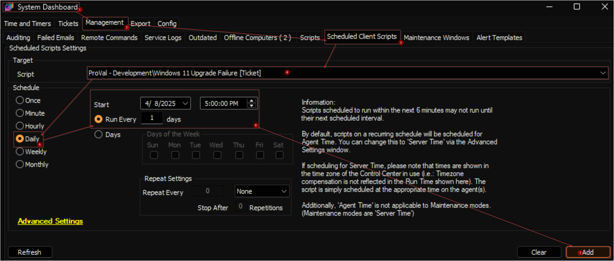

## Summary

This script generates a ticket for computers where the [Windows 11 Installer](./Windows%20_11_Installer.md) script has failed more than three times. It leverages the computer-level EDF `Windows 11 Installation Attempts` to track the number of installation attempts.

## Sample Run

This is a client script and is recommended to be scheduled to run daily.  


## Dependencies

[Windows 11 Installer](/docs/a4668ce4-9788-47a9-bb3b-1997367803ad)

## Output

- Tickets

## Ticketing

**Subject:** `Windows 11 Installer Script Failed Three Times for <Computer Name>`

**Body:**

```PlainText
The Windows 11 Installer Script has failed <Number of attempts> times for <Computer Name>. The last run time of the script was <Last Run Time>. The monitor set will not automatically run the script. 
It is recommended to use the workaround script `Install Windows 11 Feature Update [Beta, Reboot]`, which attempts troubleshooting before initiating the upgrade. Please exercise caution while running the workaround script, as it will forcefully restart the computer and may reboot up to 7 times.
```
