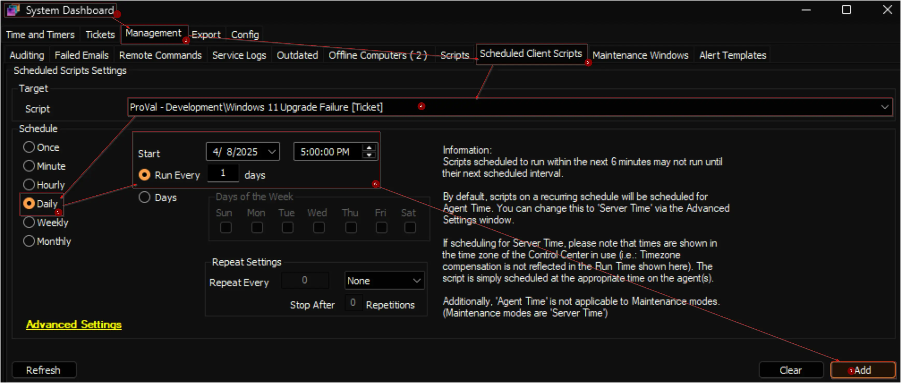

## Summary

This script generates a ticket for computers where either the [Windows 11 Installer](/docs/a4668ce4-9788-47a9-bb3b-1997367803ad) or [Install Windows 11 Feature Update [Update Assistant, Reboot]](/docs/50c89c87-2a2c-4ba8-a15b-ac05722a81ec) script has failed more than three times. It utilizes the computer-level EDF `Windows 11 Installation Attempts` to track the number of installation attempts.

> Note: *Ticket generation requires the client-level EDF **Create Installation Failure Tickets** to be enabled. For more information, refer to the [EDFs section in the solution's document](/docs/00b08a60-f202-42db-9f67-a76ea29289fa#edfs).*

## Sample Run

This is a client script and is recommended to be scheduled to run daily.  


## Dependencies

- [Script: Install Windows 11 Feature Update [Troubleshoot, Reboot]](/docs/27f8240b-603a-4af2-b9d9-480a560f8747)
- [Script: Windows 11 Installer](/docs/a4668ce4-9788-47a9-bb3b-1997367803ad)
- [Script: Install Windows 11 Feature Update [Update Assistant, Reboot]](/docs/50c89c87-2a2c-4ba8-a15b-ac05722a81ec)
- [Solution : Windows 11 Installation and Feature Update](/docs/00b08a60-f202-42db-9f67-a76ea29289fa)

## Output

- Tickets

## Ticketing

**Subject:** `<Script Name> Script Failed Three Times for <Computer Name>`

**Body:**

```PlainText
The <Script Name> Script has failed <Number of attempts> times for <Computer Name>. The last run time of the script was <Last Run Time>. The monitor set will not automatically run the script. 
It is recommended to use the workaround script `Install Windows 11 Feature Update [Automation, Reboot]`, which attempts troubleshooting before initiating the upgrade. Please exercise caution while running the workaround script, as it will forcefully restart the computer and may reboot up to 7 times.
```

## Changelog

### 2026-03-09

- Introduced a new EDF `Create Installation Failure Tickets`.
- Updated the ticket subject and body to reflect the addition of the new script to the solution.

### 2025-04-08

- Initial version of the document
