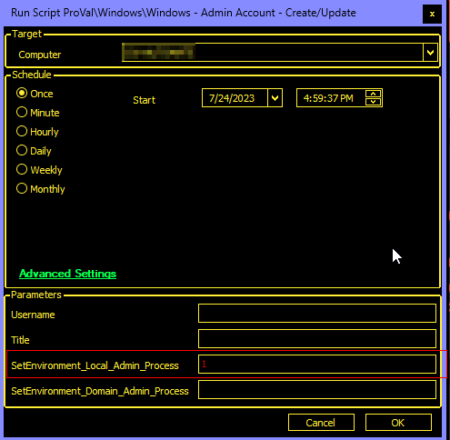
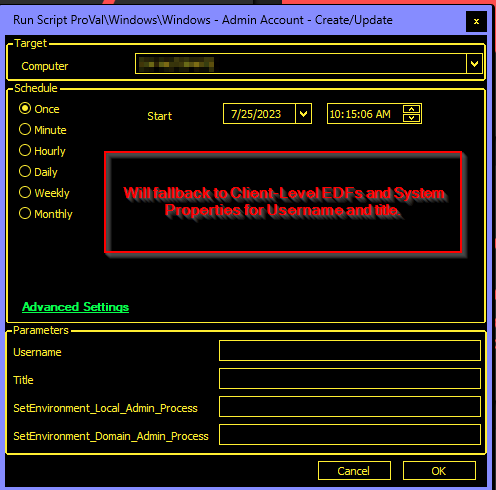
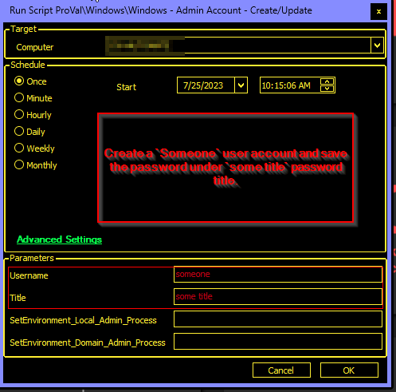
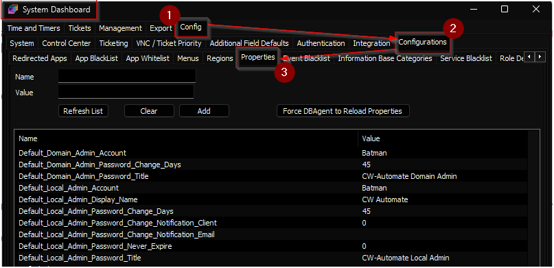
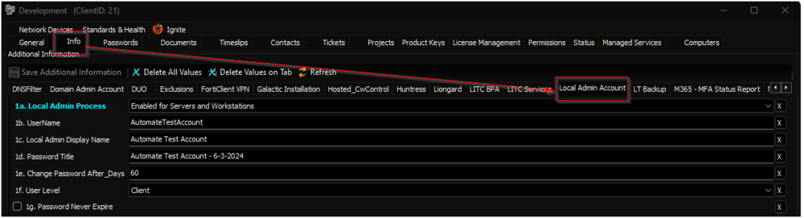
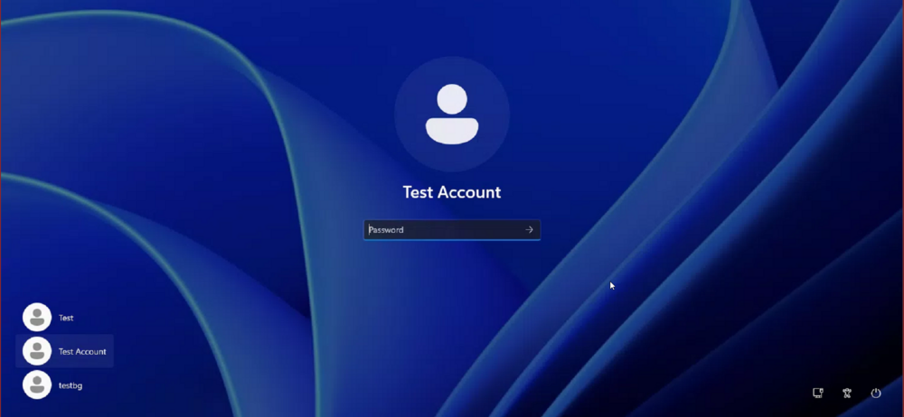
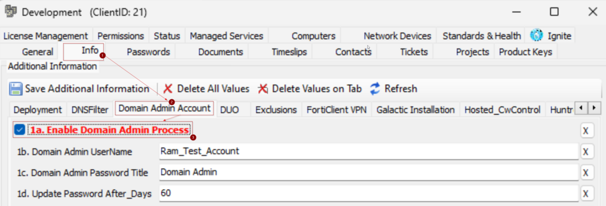
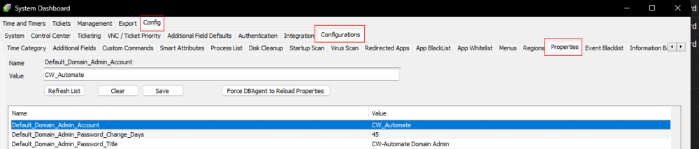

## Summary

This script creates or updates a target admin user on a domain controller or local machine and saves the credentials to the passwords list for the Automate client.

The script is executed by the [Windows Local Admin Account Process](/docs/3ff4b4be-2bca-4ef2-80d6-8761cebaeb15) and [Windows Domain Admin Account Process](/docs/6270f7b1-3cf6-433f-b6e9-b1300b545896) monitor sets or can be executed manually at the same time.  

**File Path:** `C:/ProgramData/_Automation/Script/Set-AdminAccount/Set-AdminAccount.ps1`  
**File Hash (SHA256):** `B33EBE5272A3ABDFBF99F1B480D91D4B4EE84503B97B5278684BB387D3D9F651`  
**File Hash (MD5):** `4F32BDEAD80E3967CE434F14C12CB43F`

**Note:**  
- Password verification function will not be performed for computers with PowerShell versions older than 5.
- Ensure that the password title stored in system properties and EDFs does not exceed 48 characters.
- When creating a computer-level local user account, the script appends the computer name to the end of the password title for saving the password entry. Therefore, keep the password title in system properties or EDFs as concise as possible to accommodate this addition.

## Update Notice: 06-November-2024

A new system property and EDF have been introduced for setting the password to never expire. Update the [Windows - Admin Account - Create/Update](/docs/a3038ecc-f851-4327-b1ca-a4ca485f6f9c) script from the `Prosync` plugin.

Run/debug against an online Windows machine with `SetEnvironment_Local_Admin_Process` set to `1` to implement the changes for the [Windows Local Admin Process](/docs/f8c0fb81-16ab-4ba2-85ce-d84792a49f6b) solution.  


## Update Notice: 27-September-2024

The solution's Extra Data Fields have been renamed. Update the [Windows - Admin Account - Create/Update](/docs/a3038ecc-f851-4327-b1ca-a4ca485f6f9c) script from the `Prosync` plugin.

Run/debug against an online Windows machine with `SetEnvironment_Local_Admin_Process` set to `1` to implement the changes for the [Windows Local Admin Process](/docs/f8c0fb81-16ab-4ba2-85ce-d84792a49f6b) solution.  


Run/debug against an online Windows machine with `SetEnvironment_Domain_Admin_Process` set to `1` to implement the changes for the [Windows Domain Admin Process](/docs/47f6e5ab-064e-4f15-86e6-226a274b73dc) solution.  


## Sample Run

- Running the script with the user parameter `SetEnvironment_Local_Admin_Process` set to `1` will import the EDFs and System Properties needed for the implementation of the [Windows Local Admin Process](/docs/f8c0fb81-16ab-4ba2-85ce-d84792a49f6b) solution.  
  
  
- Running the script with the user parameter `SetEnvironment_Domain_Admin_Process` set to `1` will import the EDFs and System Properties needed for the implementation of the [Windows Domain Admin Process](/docs/47f6e5ab-064e-4f15-86e6-226a274b73dc) solution.  
  

- During manual script execution, if either the `username` or `title` parameter is not provided, the script will automatically fall back to the Client-Level Extra Data Fields (EDFs) and system properties to retrieve the relevant username and title information. This fallback mechanism ensures seamless functionality and avoids any disruptions caused by missing parameters.  
  Example:  
    
  

## Dependencies

- [EPM - Windows Configuration - Internal Monitor - Windows Local Admin Account Process](/docs/3ff4b4be-2bca-4ef2-80d6-8761cebaeb15)  
- [EPM - Windows Configuration - Internal Monitor - Windows Domain Admin Account Process](/docs/6270f7b1-3cf6-433f-b6e9-b1300b545896)

## Global Parameters

| Name                          | Default | Required | Description                                                                 |
|-------------------------------|---------|----------|-----------------------------------------------------------------------------|
| MinimumPasswordLength         | 16      | True     | Minimum length of the password to create.                                   |
| ScriptEngineEnableLogger      | 0       | True     | Disabling the logging, so that the script does not accidentally print the password in script logs. |
| CreateTicketOnFailure         | 0       | False    | 0 and 1 to toggle ticket creation for the script failing to create/update the concerned user account. |

## User Parameters

| Name                               | Example | Required | Description                                                                                                   |
|------------------------------------|---------|----------|---------------------------------------------------------------------------------------------------------------|
| Username                           | user1   | False    | The username you want to create or update.                                                                   |
| Title                              | XYZ local or Domain admin | False    | The title of the password entry in the table to update or create.                                           |
| SetEnvironment_Local_Admin_Process | 1       |          | To set the environment for the [Solution - Windows Local Admin Process](/docs/f8c0fb81-16ab-4ba2-85ce-d84792a49f6b). Running the script with the user parameter `SetEnvironment_Local_Admin_Process` set to `1` will import the EDFs and System Properties needed for the implementation of the [Windows Local Admin Process](/docs/f8c0fb81-16ab-4ba2-85ce-d84792a49f6b) solution. |
| SetEnvironment_Domain_Admin_Process| 1       |          | To set the environment for the [Solution - Windows Domain Admin Process](/docs/47f6e5ab-064e-4f15-86e6-226a274b73dc). Running the script with the user parameter `SetEnvironment_Domain_Admin_Process` set to `1` will import the EDFs and System Properties needed for the implementation of the [Windows Domain Admin Process](/docs/47f6e5ab-064e-4f15-86e6-226a274b73dc) solution. |

**Note:** The script will only import the EDFs and System Properties for one solution at a time. The script needs to be executed twice to import the EDFs and System Properties for both solutions: once with `SetEnvironment_Local_Admin_Process` set to `1` and once with `SetEnvironment_Domain_Admin_Process` set to `1`.

## Script State

| Name   | Default | Required | Description                                                                                                         |
|--------|---------|----------|---------------------------------------------------------------------------------------------------------------------|
| Title  | NULL    | True     | Used to save the password set time. This allows the monitor set to use this script state to determine the age of the set password. The name of the script state will be the same as that of the password title. It can vary per client/computer, depending on the EDFs configuration. |

## Local Admin Process System Properties

| Name                                         | Default                       | Required | Description                                                                                                                                                 |
|----------------------------------------------|-------------------------------|----------|-------------------------------------------------------------------------------------------------------------------------------------------------------------|
| Default_Local_Admin_Account                  | CW_Automate                   | True     | Default Local Admin Account's user name. If the user parameter `username` is not set and client-level EDF `1c. UserName` is blank as well, then the script will use the value set in this system property. |
| Default_Local_Admin_Password_Title           | CW-Automate Local Admin       | True     | Default Title of the password entry in the table to update or create. If the user parameter `title` is not set and client-level EDF `1e. Password Title` is blank as well, then the script will use the value set in this system property. |
| Default_Local_Admin_Password_Change_Days    | 45                            | True     | Default Number of days to update the password after. It can be overridden by the client-level EDF `1f. Change Password After__Days`.                     |
| Default_Local_Admin_Display_Name              | CW Automate                   | True     | Default Display Name of the user. Displays on the logon screen at the end machine.                                                                              |
| Default_Local_Admin_Password_Change_Notification_Client | 0                     | False    | Setting this value to 1 will ensure the client receives a notification when the password is automatically rotated. This only works for client-level passwords. This is required for this script to function: [Windows - Admin Account Password Rotation Notification](/docs/1adeca30-5b12-4218-98c2-ff2806eae27e) |
| Default_Local_Admin_Password_Change_Notification_Email  | \<blank>              | False    | Setting an email address in this field will ensure an email gets sent out when the password is auto-rotated.                                          |
| Default_Local_Admin_Password_Never_Expire    | 0                             | False    | Setting the value to 1 will ensure the password never expires for the created user.                                                     |



## Local Admin Process EDFs

| Name                                     | Type      | Form    | Description                                                                                                                                                                                                 |
|------------------------------------------|-----------|---------|-------------------------------------------------------------------------------------------------------------------------------------------------------------------------------------------------------------|
| 1a. Local Admin Process                  | dropdown  | Client  | Selecting the `Enabled for Servers and Workstations` option will enable the [Windows Local Admin Account Process](/docs/3ff4b4be-2bca-4ef2-80d6-8761cebaeb15) internal monitor for all machines of the client.  Available Options: Not Enabled, Enabled for Workstations Only, Enabled for Servers and Workstations. Default Option: Not Enabled. Leaving it unset is equivalent to not enabling the auto local admin creation for the client. |
| 1b. UserName                             | Text      | Client  | Username of the local admin account to create for the Windows machines of the client. The script will use this username if the `username` parameter is not set during execution. This EDF is used by the internal monitor as well. |
| 1c. Local Admin Display Name             | Text      | Client  | Display Name of the user to set at the end machine.                                                                                                                                                       |
| 1d. Password Title                       | Text      | Client  | Title of the password entry to set/update at the client's password tab. The script will use this title if the `title` parameter is not set during execution.                                                   |
| 1e. Change Password After_Days           | Text      | Client  | Number of days after the user creation to update/change the password.                                                                                                                                   |
| 1f. User Level                           | DropDown  | Client  | Available options are `Client` and `Computer`. If `Client` is selected, then the password entry created on the client's password tab would be the exact password title. For `Computer`, `\<ComputerName>` will be added to the password title. For `Client`, all the computers at the client will share the same credential. For `Computer`, an individual credential/password per computer will be created. |
| 1g. Password Never Expire                | Check Box | Client  | Once this EDF is marked, the local user created by the script will have the password set to never expire.                                                                                               |
| Local Admin Process Exclusion             | Check Box | Computer| Marking this checkbox will exclude the computer from Automation. The monitor set will not execute the script on this machine anymore. Yet the script can be executed manually. It is placed in the `Exclusions` tab. |
| Local Admin Process Exclusion             | Check Box | Location| Marking this checkbox will exclude all the computers of this location from Automation. The monitor set will not execute the script on these machines anymore. Yet the script can be executed manually. It is placed in the `Exclusions` tab. |

**Example:**  
  
For the configuration shown in the screenshot, the solution will create `AutomateTestAccount` user against all `Windows Workstations`. The password will be saved at the client's password tab with the title `Automate Test Account - 6-3-2024` and display name `Automate Test Account`. The password for each computer will be updated once every `60` days.  


**Note:** Updating the password in the respective password entry will re-run the script against the computer (or against all computers at the client, if it's a client-level password) within 2 hours of the update.

## Domain Admin Process EDFs

| Name                                     | Type      | Form    | Description                                                                                                                                                                                                 |
|------------------------------------------|-----------|---------|-------------------------------------------------------------------------------------------------------------------------------------------------------------------------------------------------------------|
| 1a. Enable Domain Admin Process          | CheckBox  | Client  | It is mandatory to mark this EDF to enable the [Internal Monitor - Windows Domain Admin Account Process](/docs/6270f7b1-3cf6-433f-b6e9-b1300b545896) monitoring for the client. The script can still be executed manually. |
| 1b. Domain Admin UserName                | Text      | Client  | Username of the domain admin account to create for the Windows machines of the client. The script will use this username if the `username` parameter is not set during execution. This EDF is used by the internal monitor as well. |
| 1c. Domain Admin Password Title           | Text      | Client  | Title of the password entry to set/update at the client's password tab. The script will use this title if the `title` parameter is not set during execution.                                                   |
| 1d. Update Password After_Days           | Text      | Client  | Number of days after the user creation to update/change the password.                                                                                                                                   |
| Domain Admin Process Exclusion           | CheckBox  | Computer| Marking this checkbox will exclude the domain controller from Automation. The monitor set will not execute the script on this domain controller anymore. Yet the script can be executed manually. It is placed in the `Exclusions` tab. This EDF can be useful in case of multiple domains at a client, and the partner would like to exclude one of the domains from the process. In such a scenario, the partner can mark this exclusion EDF on all the domain controllers of the domain to exclude. |

**Example:**  
  
For the configuration shown in the screenshot, the solution will create `Ram_Test_Account` domain admin account and the credentials will be saved at the client's password tab with the title `Domain Admin - \<Domain>`. The password will be updated once every `60` days.  


**Note:** Updating the password in the respective password entry will re-run the script against the domain controller within 2 hours of the update.

## Domain Admin Process System Properties

| Name                                      | Default                       | Required | Description                                                                                                                                                 |
|-------------------------------------------|-------------------------------|----------|-------------------------------------------------------------------------------------------------------------------------------------------------------------|
| Default_Domain_Admin_Account              | CW_Automate                   | True     | Default Domain Admin Account's user name. If the user parameter `username` is not set and client-level EDF `1b. Domain Admin UserName` is blank as well, then the script will use the value set in this system property. |
| Default_Domain_Admin_Password_Title       | CW-Automate Domain Admin      | True     | Default Title of the password entry in the table to update or create. If the user parameter `title` is not set and client-level EDF `1c. Domain Admin Password Title` is blank as well, then the script will use the value set in this system property. (Domain Name will be added to the end of the title while storing it to the passwords tab, e.g., CW-Automate Domain Admin - [testdomain.local](http://testdomain.local)) |
| Default_Domain_Admin_Password_Change_Days| 45                            | True     | Default Number of days to update the password after. It can be overridden by the client-level EDF `1d. Update Password After_Days`.                     |



## Output

- Ticket (If Enabled)
- Script log

## Ticketing

**Subject:** `\<ComputerName>: Windows - Admin Account - Create/Update - Failed`  

**Body:**  
``` 
Automate attempted to create/update the admin account <username> but failed. 
Attempted credentials are saved as <Title> at the passwords tab of the client in Automate.
```
```
Account Creation/Update Output: <Output of the PowerShell Script>
```
