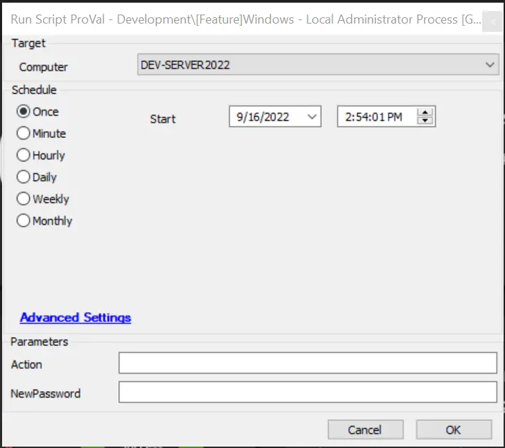
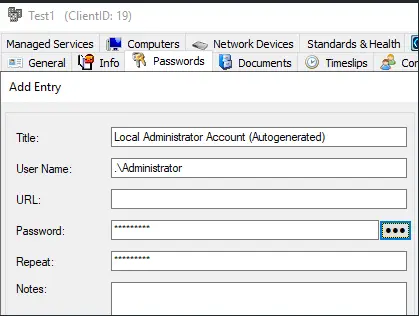
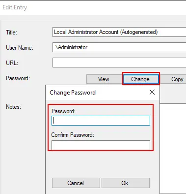

## Summary

This updated script helps to enable or disable the administrator account on any machine except for domain controllers (DCs). To enable or disable the admin account on a machine, we need to specify the values of the user parameter "Action".

This script is designed to do the following:
1. Create a client-level password entry based on the user parameter entered in the script on the first run.
2. Enable and set a password for the Administrator account on any machine except for DCs.
3. Allow all other workstations at that client to use the same password generated from the first run.

**Time Saved by Automation:** 5 Minutes

## Sample Run

## Variables

| Name                | Description                                                                                                                                                    |
|---------------------|----------------------------------------------------------------------------------------------------------------------------------------------------------------|
| @PasswordID@        | This is the numerical database value for the password if it has already been created.                                                                         |
| @PrecedingInstance@ | This checks to see if this script has already been run recently. If it has, it will NOT generate another password into the client's password table.           |
| @NewPassword@       | On the first run, this is the password that will be used for the local admin change process. If the password title does not exist at the client, then it will create the password. If the password title already exists, it will update the password. |
| @ShellResult@       | This is used to verify that the password change/setup for the account functioned properly.                                                                     |

#### Global Parameters

| Name                | Example                                               | Required | Description                                                                                                                                                                                                                     |
|---------------------|-------------------------------------------------------|----------|---------------------------------------------------------------------------------------------------------------------------------------------------------------------------------------------------------------------------------|
| Password Title      | Local Administrator Account (Autogenerated) - Default | True     | This is the title (name) of the password for the client-level password. This is used throughout this solution to ensure that the right password is being used. Please use the default or set this to something that is globally consistent throughout the environment. |

#### User Parameters

| Name        | Example                                     | Required | Description                                                                                                                                                                                                                     |
|-------------|---------------------------------------------|----------|---------------------------------------------------------------------------------------------------------------------------------------------------------------------------------------------------------------------------------|
| NewPassword | x8PFc3V2qjFV!%#2 (Please do not use this password) | False    | This is the password that will be set on the aforementioned "Password Title" global parameter. This is the password that will be used for all of the local admin accounts. If this script is being run for the first time at a client, this MUST be set. Subsequent runs will not require the password to be set unless a password change has been requested. |
| Action      | Disable                                     | False    | Disable will disable the local administrator account.                                                                                                                                                                          |

## Process

### Running this script:

**1st run:** This script will need to be run at least once on a machine at the client, with the NewPassword user parameter filled out. This is what generates the password to be used for this client.

**Subsequent runs:** This script will always reference the password entry in the client password table. If that password title is changed or missing, the script will need to create an entry first.

**Note:** The client-level password entry can be created manually if desired, but the title of the password **must** match the title of the password in the Global Parameter for Password Title. The password can also be changed anytime by simply adjusting the password at the client level.

**(Manual password creation before first run)**

**(Manual password change)**

### Script Process:

- **Initial Check:** This script is designed to run on any machine except DCs, and the initial check in the script will verify that the machine is not a DC. If it is a Domain Controller, the script will exit.

- **Check for Action:** The script will check if the value provided for the parameter Action is "enable" or "disable." If the Action = "Disable," then the script will jump to the disable label.

- **Check for Existing Password:** The script will check if a password has already been created. If there is an existing password that matches, the script will jump to the "Password Exists" label.

- **Create Password:** If no password has been set for the client, the script will create or update the password with the data from the "NewPassword" user parameter.

- **Check for a Created Password:** This section will verify that the password has been created successfully.

- **Password Exists:** This section will gather the password information from the client and then take the following actions on the endpoint:
  1. Activate the Administrator account (if not already active)
  2. Set the designated password for the Administrator account
  3. The script will also verify if the password meets the complexity requirements for the target machine
  4. Verify the password change was successful by running a "WHOAMI" command via shell. If the command returns the Administrator username, it was successful and the script will exit with success. If not, the script will be considered failed and continue.

- **Password Creation Failed:** This section will create a log message indicating the password setup failed, and the script will exit as failed.

- **Missing Password Parameter:** If there are no matching password titles for the client, and the NewPassword user variable is not filled out, this script will write a log message indicating that the parameter was not properly filled out and will exit as failed.

- **User Test Failed:** If the command to verify the password fails, the script will create a log message noting that the account failed to authenticate and will exit as failed.

- **Password Complexity Failed:** If the password did not meet the target device's complexity requirements, the password change will fail. When this happens, please adjust the client-level password to meet proper complexity requirements. Typically, password complexity requirements are 10+ characters in length, include a capital letter, a lowercase letter, a number, and a special character.

## Output

Script log messages