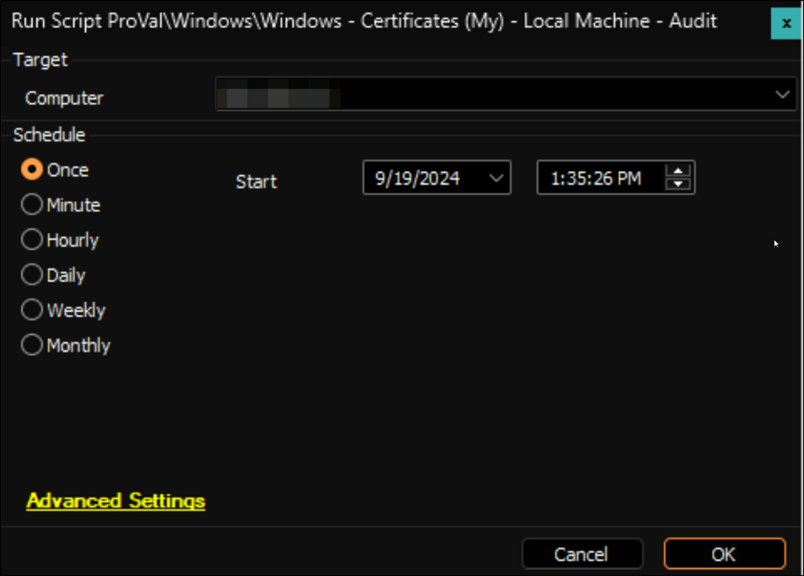

## Summary

This script is designed to run a PowerShell script and pull any and all certificates in the personal certificate repository on every machine that it is run on. It should be scheduled to run intermittently on all machines you would like to monitor the certificates on. Suggested targets: App, IIS, and Exchange servers.

**File Path:** `C:/ProgramData/_Automation/Script/Get-LocalCerts/Get-LocalCerts.ps1`  
**File Hash (SHA256):** `7835B8AAFD28CF9810494D7627ED035F45B562614FFA7526AB2D3F93E6F5301E`  
**File Hash (MD5):** `5B035EFE21342903EAFE323029A2A953`

## Sample Run

#### Global Parameters

| Name      | Example                                                           | Required | Description                                                                                           |
| --------- | ----------------------------------------------------------------- | -------- | ----------------------------------------------------------------------------------------------------- |
| TableName | [plugin_proval_certs](/docs/44048760-bd04-451d-82ea-b6eee6a03552) | True     | This indicates what the table name will be created to dump the data to. **This must not be changed.** |

## Output

- Script log
- Custom Table
- Dataview

