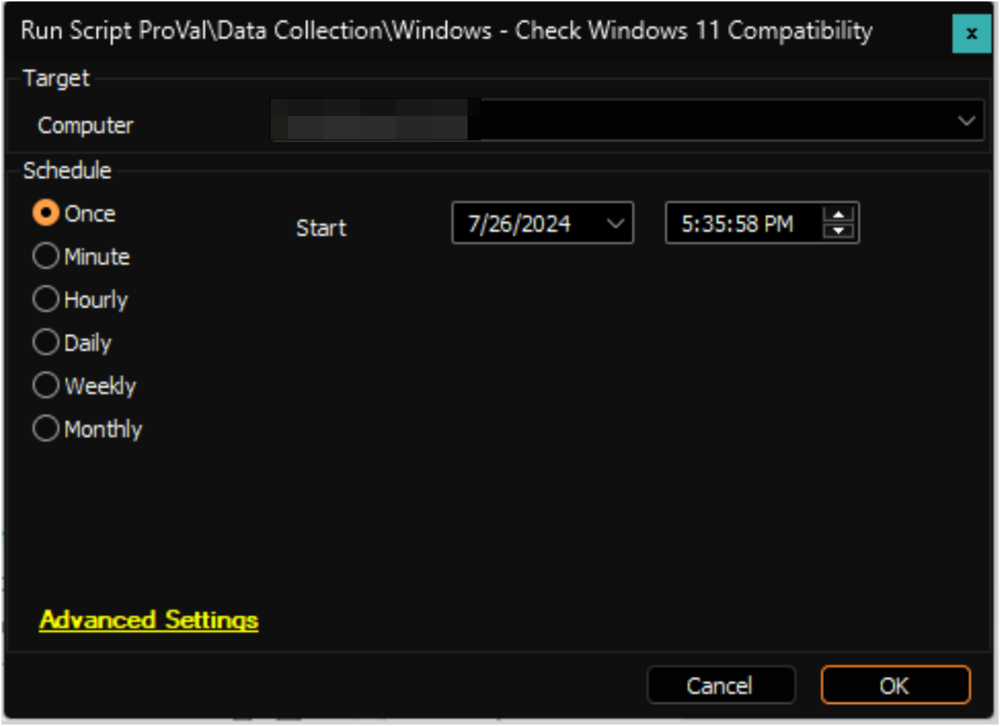

## Summary

The script will create the `plugin_proval_windows11_readiness` table if it's missing from the environment. It will then run a PowerShell script against the target Windows machine and update the [plugin_proval_windows11_readiness](/docs/74cca89e-effd-4af7-a73a-53a30b91c8a7) table with the relevant data. This data can be viewed in the [Windows 11 Upgrade Compatibility](/docs/36ca4c95-af9e-443b-8fe5-33e910107650) dataview.

## File Hash
**File Path**: `C:\ProgramData\_Automation\script\Check-Windows11Compatibility\Check-Windows11Compatibility.ps1`  
**File Hash (Sha256)**: `B394B848BD4D6E95A1E0C7F78CB8D3423871D988FC9E4FCCE3D2E4F9D80C8E89`  
**File Hash (MD5)**: `8C311A3D8600227D6DBBDE89DFD87DBC`

**File Path**: `C:\ProgramData\_Automation\script\Check-Windows11Compatibility\HardwareReadiness.ps1`  
**File Hash (Sha256)**: `3F21C32818BFC3A20293317FF91A62ADB349B5A0D468A6DDDEA752F68365C24A`  
**File Hash (MD5)**: `96969DBB963AD9EDDB5E44BC4CFE6071`

## Dependencies
`https://download.microsoft.com/download/e/1/e/e1e682c2-a2ee-46c7-ad1e-d0e38714a795/HardwareReadiness.ps1`

## Sample Run

## Variables

| Name                | Description                                                                                      |
|---------------------|--------------------------------------------------------------------------------------------------|
| ProjectName         | Check-Windows11Compatibility                                                                     |
| WorkingDirectory     | C:/ProgramData/_Automation/Scripts/Check-Windows11Compatibility                                 |
| TableName           | [plugin_proval_windows11_readiness](/docs/74cca89e-effd-4af7-a73a-53a30b91c8a7)             |
| ScriptPath          | C:/ProgramData/_Automation/Scripts/Check-Windows11Compatibility/Check-Windows11Compatibility.ps1 |

## Output

Dataview: [Windows 11 Upgrade Compatibility](/docs/36ca4c95-af9e-443b-8fe5-33e910107650)  
Custom table: [plugin_proval_windows11_readiness](/docs/74cca89e-effd-4af7-a73a-53a30b91c8a7)

