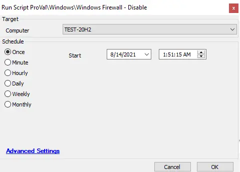

## Summary

This script runs a standard shell command to disable the Windows Firewall for all profiles, namely public, domain, and private, and subsequently verifies its execution within the script.

## Sample Run

## Process

The script will execute if the Windows Firewall is enabled on the machine. It runs a standard shell command to disable the Windows Firewall for all profiles—public, domain, and private—and then verifies its execution within the script.

## Output

- Script log
