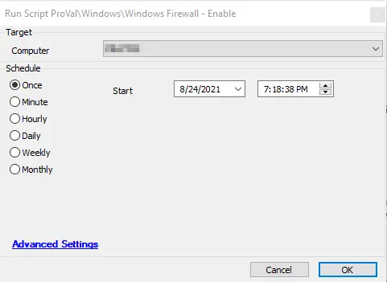

## Summary

The script enables the Windows firewall for all profiles, i.e., public, domain, and private.

**Time Saved by Automation:** 5 Minutes

## Sample Run

## Process

- The script runs a standard shell command to enable the Windows firewall for all profiles, i.e., public, domain, and private.
- It verifies itself inside the script.

## Output

- Script log