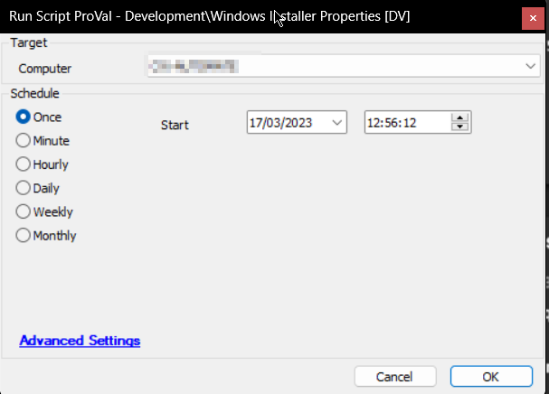

## Summary

The "CWM - Automate - Script - Windows Installer Properties [DV]" is a script that gathers a set of properties for the applications installed on a machine. This script is designed to collect information for the applications that are listed in the software table only. The information collected includes properties such as the product name, version, installation date, and more.

Once the information has been gathered, the script stores it in an SQL table named "pvl_win_installer_properties." Users can then review the gathered information in the dataview named "Windows Installer Properties [Script]." The dataview presents the gathered information in a tabular format, making it easy for users to analyze and interpret the data.

Overall, the "CWM - Automate - Script - Windows Installer Properties [DV]" script provides a useful tool for users who need to manage and monitor the applications installed on their machine. The script's ability to store the gathered information in an SQL table and present it in a dataview adds value and convenience to the data management process. It fetches a set of properties for the installed applications on the machine, with results limited to the application list present in the `software` table only.

## Sample Run

## Dependencies

- [CWM - Automate - Script - OverFlowedVariable - SQL Insert - Execute](/docs/34cee8fe-1b6b-4558-a890-2face427ceb8)
- [CWM - Automate - Script - PowerShell Response - All Errors - Check](/docs/89346170-6657-4784-93cf-c0aa024b4386)

## Variables

| Name                  | Description                                                                 |
|-----------------------|-----------------------------------------------------------------------------|
| TableName             | Name of the custom table to dump the output, `pvl_win_installer_properties`. |
| InstalledApplications  | Distinct names of the applications installed on the machine from the software table. |
| psout                 | Output of the PowerShell script attempting to grab the information.        |

## Output

- Custom Table
- Dataview
- Script Logs

