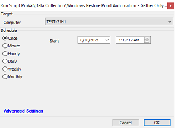

## Summary

This script helps to gather all restore point information of a workstation and store the details in a Dataview called Restore Point Audit - Workstations.

**Time Saved by Automation:** 30 Minutes

## Sample Run

## Dependencies

- [Restore Point Audit - Workstations](/docs/29f1dee2-174e-47e1-ae3a-f233fe55386c)
- [plugin_proval_restore_points](/docs/ebb1d05a-bb80-45e7-a4be-9cc73b8f308d)

## Process

This script will create a custom table `plugin_proval_restore_points` if it doesn't exist. The script will then run PowerShell commands to gather information regarding the restore points and update the data in the custom table using SQL queries. The script is designed to work on Windows workstations only.

## Output

- Script log
- Dataview

