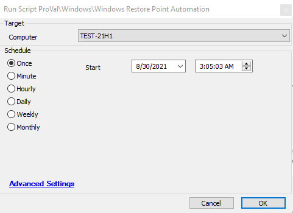

## Summary

This script runs against a system that does not have the Target Restore Point EDF set and collects all available restore points. If run on a system with the EDF set (EDF: Available restore point), it will attempt to restore the system.

**Time Saved by Automation:** 30 Minutes

## Sample Run

## Dependencies

[plugin_proval_restore_points](/docs/ebb1d05a-bb80-45e7-a4be-9cc73b8f308d)

## Variables

| Variable Name | Description                                          |
|---------------|------------------------------------------------------|
| RestPoint     | This variable will store the result of the EDF: Available restore point |

## Process

This script will create a Custom Table `plugin_proval_restore_points` if it doesn't exist. The script will then check the EDF: Available restore point value and gather information regarding the restore points. If the script is run on a machine where the EDF: Available restore point is not set, it will update the data in the Custom table using SQL queries. If the EDF is set, it will start restoring the system using PowerShell.

## Output

- Script log

