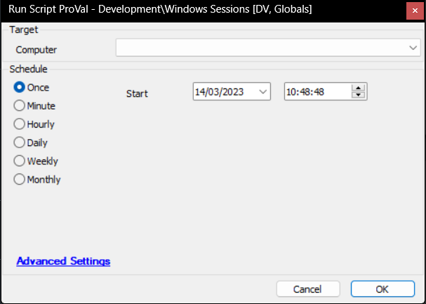

## Summary

Executes the `query session` command and stores the result in a custom table.

## Sample Run

## Dependencies

[CWM - Automate - Script - OverFlowedVariable - SQL Insert - Execute](/docs/34cee8fe-1b6b-4558-a890-2face427ceb8)

## Variables

| Name  | Description                                                                                     |
|-------|-------------------------------------------------------------------------------------------------|
| psout | Output of the PowerShell script executing and parsing the `Query Session` command              |

#### Global Parameters

| Name          | Default | Required | Description                                                                                                           |
|---------------|---------|----------|-----------------------------------------------------------------------------------------------------------------------|
| retentiondays | 1       | True     | Number of days to keep the historical data. Any data older than the specified days will be removed from the database on the next execution of the script. |

## Output

- Dataview
- Custom Table

