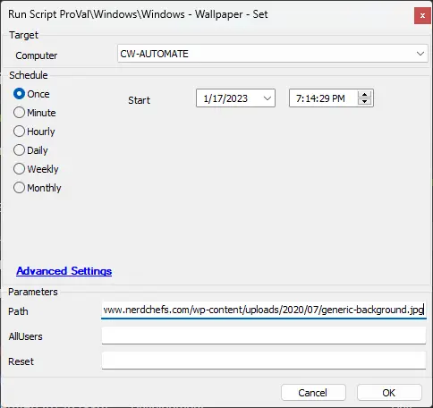
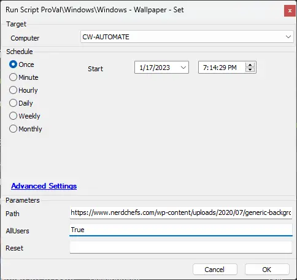
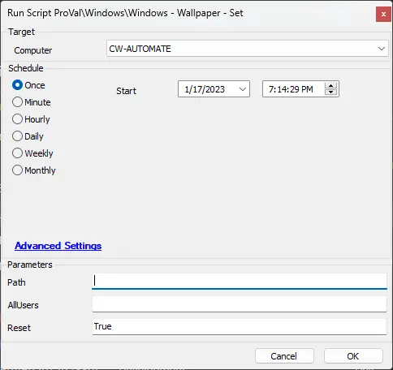

## Summary

This document outlines how to set the active desktop wallpaper for all users from a local path or a URL. It can optionally enforce the wallpaper for all users on login.

**Time Saved by Automation:** 10 Minutes

## Sample Run

**Set Mode:**  

**Enforcement Mode:**  

**Reset Mode:**  

### User Parameters

| Name      | Example                                             | Required | Description                                                                                                   |
|-----------|-----------------------------------------------------|----------|---------------------------------------------------------------------------------------------------------------|
| Path      | C:\user\myuser\Pictures\CoolWallpaper.png          | Semi     | Either a path to a local image or a URL.                                                                      |
| AllUsers  | True                                               | False    | Set this to "True" to enforce the wallpaper for all users on login.                                          |
| Reset     | True                                               | Semi     | Set only this parameter to "True" to remove all enforcement and reset all users' wallpapers back to their previous one. If they do not have a previous wallpaper, the default Windows wallpaper will be used. |

## Output

- Script Logs
