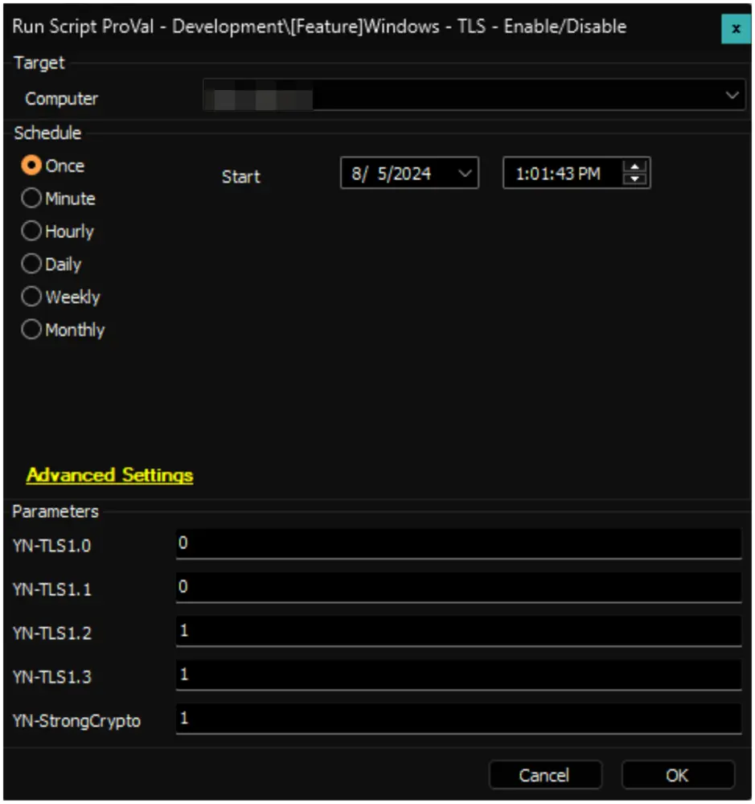

## Summary

The script will be used to enable or disable any versions of TLS (v1.0, v1.1, v1.2, v1.3) simultaneously by updating the registry.

[Learn more about enabling TLS 1.2](https://learn.microsoft.com/en-us/entra/identity/hybrid/connect/reference-connect-tls-enforcement#enable-tls-12)

## File Hash  
- **File Path**: `C:/ProgramData/_Automation/Script/Set-TLS/Set-TLS.ps1`
- **SHA256**: `F23026F65794709EBF98E4E78653D0605FAF577943524DED7423654CBA8227E5`  
- **MD5**: `25240999C55600A35293FCA3EEC73BD8`

## Sample Run

To disable TLS 1.0 and TLS 1.1, and to enable TLS 1.2 and TLS 1.3 along with strong crypto for .NET.

#### User Parameters

| Name            | Example | Required            | Description                                                                                     |
|-----------------|---------|---------------------|-------------------------------------------------------------------------------------------------|
| YN-TLS1.0      | 0       | 1 or 0 or blank     | To enable TLSv1.0, enter 1; to disable it, enter 0, or leave blank.                          |
| YN-TLS1.1      | 0       | 1 or 0 or blank     | To enable TLSv1.1, enter 1; to disable it, enter 0, or leave blank.                          |
| YN-TLS1.2      | 1       | 1 or 0 or blank     | To enable TLSv1.2, enter 1; to disable it, enter 0, or leave blank.                          |
| YN-TLS1.3      | 1       | 1 or 0 or blank     | To enable TLSv1.3, enter 1; to disable it, enter 0, or leave blank.                          |
| YN-StrongCrypto | 1       | 1 or 0 or blank     | To enable Strong Crypto for .NET, enter 1; to disable it, enter 0, or leave blank.           |

## Output

- Script log