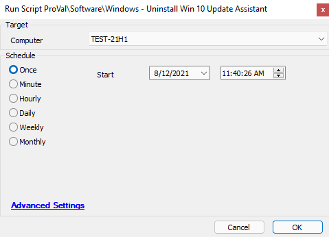

## Summary

This script will attempt to remove the Windows 10 Upgrade Assistant application from the target machine.

**Time Saved by Automation:** 5 Minutes

## Sample Run

## Dependencies

The target device must be running a Windows operating system and must have the Windows 10 Upgrade Assistant installed.

## Variables

None

## Process

The script will first check if the Windows 10 Upgrade Assistant is installed. If it is not, the script will proceed to the Else section and exit successfully. If the software is detected, the script will continue to the Then section. The script will look for the `Windows10UpgraderApp.exe` file; if this file is missing, the script will exit with an error. If the script detects the file, it will run a command to uninstall the software and log the output from the command. The script will update the software inventory and verify that the software was uninstalled. If the script successfully removes the software, it will exit successfully with a log message. If the script fails to remove the software, it will exit with an error.

## Output

- Script log messages only

