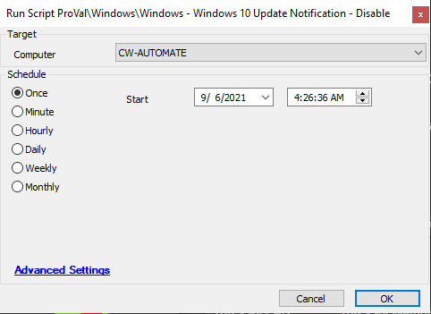

## Summary

This script will disable the prompt message to users from Microsoft warning about the deprecation of Windows 10 v1909.

**Time Saved by Automation:** 10 Minutes

## Sample Run

## Process

This script will disable the prompt message to users from Microsoft warning about the deprecation of Windows 10 v1909.

## Output

- Script log

