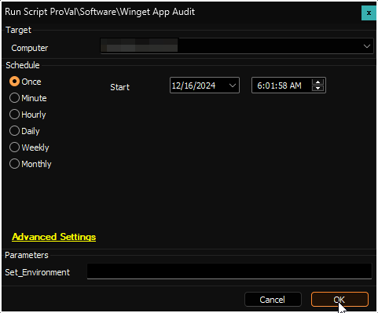

## Summary

The script conducts an audit of the computer for applications supported by Winget and stores the information in a custom table called [pvl_winget_audit](/docs/904989a6-fe21-4e40-adb6-17d1168c830e). It retrieves data for both system-level and user-level applications. However, user-level application data will not be retrieved if there are no logged-in users on the computer.

## File Hash

**File Path:** `C:\ProgramData\_automation\Script\Get-WingetReport\Get-WingetReport.ps1`  
**File Hash (Sha256):** `0ECF004A270D0EABCB0D89FC9C05CF027709AE541E9D53DC894E309041344B12`  
**File Hash (MD5):** `26D327FAD52EB73F7AD28A2B72E24ECB`  

**File Path:** `C:\ProgramData\_automation\Script\Get-WingetReport\Manage-OverFlowedVariable.ps1`  
**File Hash (Sha256):** `79B76E6780B61ED657C7FC07C5C0D9A0662165066D5BAD95D9D672513BADD674`  
**File Hash (MD5):** `12B41CDBC04010E638D3FFB8A4BDB1D6`  

## Update Notice: 02-April-2025

A new column has been introduced to pvl_winget_audit table. To update the table's structure, run the script with the Set_Environment parameter set to 1 after importing it.  

## Sample Run

**First Run:** Run the script with the `Set_Environment` parameter set to `1` for the first run to create the [pvl_winget_audit](/docs/904989a6-fe21-4e40-adb6-17d1168c830e) table used by the solution.  

**Regular Execution:**  

## Dependencies

- [SWM - Software Update - Internal Monitor - Execute Script - Winget App Audit](/docs/af67ed08-40af-4899-ae8f-5e64f9bfb851)
- [CWM - Automate - Script - OverFlowedVariable - SQL Insert - Execute](/docs/34cee8fe-1b6b-4558-a890-2face427ceb8)

## Variables

| Name              | Description                       |
|-------------------|-----------------------------------|
| projectName       | Get-WingetReport                  |
| workingDirectory   | C:/ProgramData/_automation/script/Get-WingetReport |
| scriptPath        | C:/ProgramData/_automation/script/Get-WingetReport/Get-WingetReport.ps1 |
| jsonPath          | C:/ProgramData/_automation/script/Get-WingetReport/Get-WingetReport.json |
| tableName         | [pvl_winget_audit](/docs/904989a6-fe21-4e40-adb6-17d1168c830e) |

## User Parameters

| Name              | Example | Required                      | Description                                                                                          |
|-------------------|---------|-------------------------------|------------------------------------------------------------------------------------------------------|
| Set_Environment    | 1       | True (for first execution)    | Run the script with the `Set_Environment` parameter set to `1` for the first run to create the [pvl_winget_audit](/docs/904989a6-fe21-4e40-adb6-17d1168c830e) table used by the solution. |

## Output

- Script log
- Custom table
- Dataview

