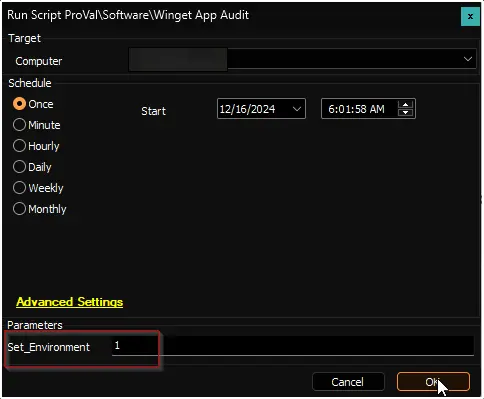
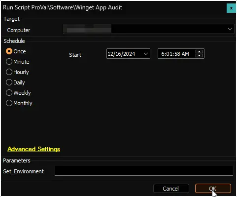

## Summary

The script audits the computer for applications supported by Winget and stores the results in the custom table [pvl_winget_audit](/docs/904989a6-fe21-4e40-adb6-17d1168c830e). It uses the [Get-WingetReport](/docs/a344216a-5ff8-426d-a7d7-a688500990b4) PowerShell script, which now runs the audit entirely within a single execution by leveraging scheduled tasks internally. System‑scope and, when a user is logged on, user‑scope applications are captured automatically; there is no need to run the Automate script twice.

Auditing is enabled via the same client‑level **Winget Auto Update** EDF that controls the auto‑update solution. When the EDF is set to any of the following values, the audit will run:

- `Enabled for Servers and Workstations`
- `Enabled for Workstations Only` (only if the computer is a workstation)
- `Audit Only`

If the EDF is set to `Disabled`, or if the computer/location is excluded via the corresponding exclusion EDFs, the audit will not run.

## Update Notice: 30‑June‑2026

The solution now depends on the new **Winget Auto Update** EDF structure, which includes the `Audit Only` dropdown option. If you are updating an existing installation after 30‑June‑2026, run the script with `Set_Environment = 1` to ensure the latest EDF definitions are present and the `pvl_winget_audit` table structure is up to date.  

## Sample Run

**First Run / Environment Setup:**  
Run the script with the `Set_Environment` parameter set to `1` for the first run (or after updating the solution after 30‑June‑2026) to create the [pvl_winget_audit](/docs/904989a6-fe21-4e40-adb6-17d1168c830e) table and to import the required EDFs.  

**Regular Execution:**  

## Dependencies

- [Internal Monitor - Execute Script - Winget App Audit](/docs/af67ed08-40af-4899-ae8f-5e64f9bfb851)
- [Script - OverFlowedVariable - SQL Insert - Execute](/docs/34cee8fe-1b6b-4558-a890-2face427ceb8)
- [Solution - Winget Auto Update](/docs/92b2ccf2-534f-46b6-b1d1-dd77dea47ba8)

## Global Variables

| Name | Value | Accepted Values | Description |
| ---- | ----- | --------------- | ----------- |
| Debug | `False` | `False`, `True` | When `True`, enables informational logging; when `False` (default), informational logs are suppressed to avoid adding entries to the `h_scripts` table. Set to `True` to assist with troubleshooting. |
| ScriptEngineEnableLogger | `False` | `False`, `True` | When `True`, enables final (success/failure) logging; when `False` (default), these logs are suppressed to avoid adding entries to the `h_scripts` table. Set to `True` to assist with troubleshooting. |

## User Parameters

| Name              | Example | Required                      | Description                                                                                          |
|-------------------|---------|-------------------------------|------------------------------------------------------------------------------------------------------|
| Set_Environment    | 1       | True (for first execution)    | Run the script with the `Set_Environment` parameter set to `1` for the first run (or when upgrading after 30‑June‑2026) to create the [pvl_winget_audit](/docs/904989a6-fe21-4e40-adb6-17d1168c830e) table and import the required EDFs. |

## Client‑Level EDF

*These EDFs are shared with the Winget Auto Update solution and are imported automatically by the `Set_Environment` run. See also [Configure Winget Auto Update](/docs/1e0c72c6-b9aa-454a-8643-ac7c7e1e7d55).*

| Name                          | Example                                             | Type      | Dropdown Options                                                                                           | Description                                                                                                                                                       |
|-------------------------------|-----------------------------------------------------|-----------|------------------------------------------------------------------------------------------------------------|-------------------------------------------------------------------------------------------------------------------------------------------------------------------|
| Winget Auto Update            | Enabled for Servers and Workstations                | Dropdown  | <ul><li>Disabled</li><li>Enabled for Workstations Only</li><li>Enabled for Servers and Workstations</li><li>Audit Only</li></ul> | Enables the Winget Auto Update solution, including application auditing. **Audit Only** performs inventory without configuring any update schedules.               |
| WAU - MonitorFailures         |                                                     | Check-Box |                                                                                                            | This EDF is used by the auto‑update solution only; it does not affect the audit.                                                                                   |

*Other client‑level EDFs like Whitelist, Blacklist, InstallUserContext, UpdateInterval, etc., are part of the auto‑update configuration and are not required for the audit. They are available for informational purposes but are ignored by the audit script.*

## Location‑Level EDF

| Name                          | Type      | Section    | Description                                                                                      |
|-------------------------------|-----------|------------|--------------------------------------------------------------------------------------------------|
| Exclude From Winget Auto Update | Check-Box | Exclusions | Flag this EDF to exclude the location from the Winget Auto Update solution and its audit.       |

## Computer‑Level EDF

| Name                          | Type      | Section    | Description                                                                                      |
|-------------------------------|-----------|------------|--------------------------------------------------------------------------------------------------|
| Exclude From Winget Auto Update | Check-Box | Exclusions | Flag this EDF to exclude the computer from the Winget Auto Update solution and its audit.       |

## Output

- Script log  
- Custom table ([pvl_winget_audit](/docs/904989a6-fe21-4e40-adb6-17d1168c830e))  
- Dataview ([Winget App Audit](/docs/399a36e3-da83-4437-914b-71e9b844c0d2))

## Changelog

### 2026-06-30

- Replaced the previous two‑pass (system + user) execution with a single run that internally creates scheduled tasks to capture both system and user application data.
- Now uses the [Get-WingetReport](/docs/a344216a-5ff8-426d-a7d7-a688500990b4) PowerShell script for the entire audit process.
- Added dependency on the **Winget Auto Update** EDF for enabling the audit; the `Audit Only` option is now required.
- The `Set_Environment` run will import the updated EDFs (including `Audit Only`) and refresh the `pvl_winget_audit` table structure.

### 2026-04-06

- Code signed PowerShell script
- Updated the downloadUrl for both 7zr.exe and 7z.7z

### 2026-01-20

- The agnostic for the script had bugs related to Invoke-WebRequest and was throwing incorrect DISM Error When Adding "Provisioned" Package. After the agnostic got fixed, the automate implementation was updated to fix the failures.

### 2025-04-10

- Adjusted the script to reset the `$AutoUpdateRunTime` variable in the foreach loop

### 2025-04-08

- Initial version of the document
