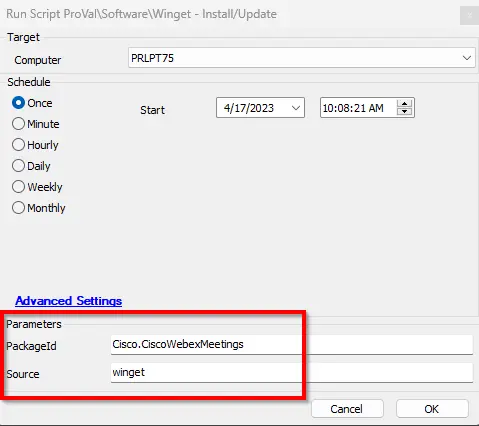

## Summary

This script is created to install and update applications whose packages are available in Winget.  

Please find the application package at the following URL: [https://winget.run/search](https://winget.run/search)

## File Hash

- **Script Path:**  `C:\ProgramData\_Automation\Script\Invoke-WingetProcessor\Invoke-WingetProcessor.ps1`  
- **File Hash (SHA256):** `E77F11DF22570228C4C076EA5181F5C4432C8C29501C4537574D6D9DA4ED077C`  
- **File Hash (MD5):** `988151DA4B1FF497FE63C71C2141C4EB`

## Sample Run

## Dependencies

- [Invoke-WingetProcessor](/docs/8496c2e9-0e52-4961-a1f1-4a95296e8cf7)
- [Solution - Update/Deploy Target Application to Latest Version [Winget]](/docs/2487a1f4-6f85-42f3-91d0-4aab8c875021)

## Global Variables

| Name | Value | Accepted Values | Description |
| ---- | ----- | --------------- | ----------- |
| Debug | `False` | `False`, `True` | When `True`, enables informational logging; when `False` (default), informational logs are suppressed to avoid adding entries to the `h_scripts` table. Set to `True` to assist with troubleshooting. |
| ScriptEngineEnableLogger | `False` | `False`, `True` | When `True`, enables final (success/failure) logging; when `False` (default), these logs are suppressed to avoid adding entries to the `h_scripts` table. Set to `True` to assist with troubleshooting. |
| ProjectName | Invoke-WingetProcessor | | This references the Agnostic Script name without the .ps1 and should not be changed. |

## User Parameters

| Name      | Example                          | Required | Description                                |
|-----------|----------------------------------|----------|--------------------------------------------|
| PackageId | Cisco.CiscoWebexMeetings        | True     | The Winget package you wish to install.   |
| Scope     | msstore, winget                   | True     | The source to use when obtaining the package. |
| OptionalParameter     | --Scope Machine                   | False     | Specifies option parameters to deploy/update/remove the application(s) |

## Process

Please refer to [Invoke-WingetProcessor](/docs/8496c2e9-0e52-4961-a1f1-4a95296e8cf7) for the process.

## Output

- Script Log

## FAQ

**Q. For auto-deployment of application we have monitor [Application - Install/Update - [Winget]](/docs/9b40d1cd-7886-416f-b56e-11ab3a44befb), does the auto-deployment work with the optional parameter needed?**

**A.** No, for auto-deployment you need to copy this script and have to set the OptionalParameter user param to the global parameter with the value set to it and apply that as an autofix because the auto-deployment monitor do not pass the optional parameter value.
