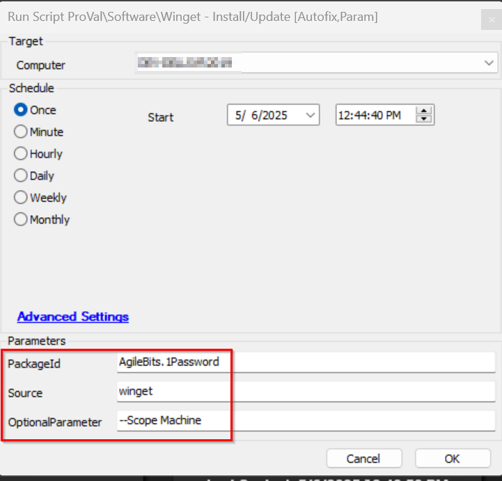

## Summary

This document explains how to install a Winget package on a target endpoint.

## Sample Run

## Dependencies

- [SWM - Software Management - Powershell - Invoke-WingetProcessor](/docs/8496c2e9-0e52-4961-a1f1-4a95296e8cf7)

### Global Parameters

| Name        | Example                | Required | Description                                                                 |
|-------------|------------------------|----------|-----------------------------------------------------------------------------|
| ProjectName | Invoke-WingetProcessor | True     | This represents the name of the Agnostic script and should not be changed. |

### User Parameters

| Name      | Example                          | Required | Description                                |
|-----------|----------------------------------|----------|--------------------------------------------|
| PackageId | Cisco.CiscoWebexMeetings        | True     | The Winget package you wish to install.   |
| Scope     | msstorewinget                   | True     | The source to use when obtaining the package. |
| OptionalParameter     | --Scope Machine                   | False     | Specifies option parameters to deploy/update/remove the application(s) |

## Process

Please refer to [SWM - Software Management - Powershell - Invoke-WingetProcessor](/docs/8496c2e9-0e52-4961-a1f1-4a95296e8cf7) for the process.

## Output

- Script 

## FAQ

For auto-deployment of application we have monitor [Application - InstallUpdate - Winget](/docs/9b40d1cd-7886-416f-b56e-11ab3a44befb), does the auto-deployment work with the optionalparameter needed?

No, for auto-deployment you need to copy this script and have to set the OptionalParameter user param to the global parameter with the value set to it and apply that as an autofix because the auto-deployment monitor do not pass the optional parameter value.
