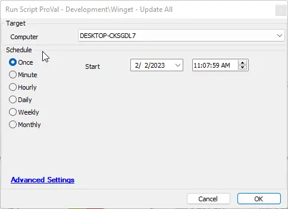

## Summary

This script will update all Winget packages found on an endpoint.

## Sample Run

## Dependencies

- [Invoke-WingetProcessor](/docs/8496c2e9-0e52-4961-a1f1-4a95296e8cf7)

## Global Variables

| Name | Value | Accepted Values | Description |
| ---- | ----- | --------------- | ----------- |
| Debug | `False` | `False`, `True` | When `True`, enables informational logging; when `False` (default), informational logs are suppressed to avoid adding entries to the `h_scripts` table. Set to `True` to assist with troubleshooting. |
| ScriptEngineEnableLogger | `False` | `False`, `True` | When `True`, enables final (success/failure) logging; when `False` (default), these logs are suppressed to avoid adding entries to the `h_scripts` table. Set to `True` to assist with troubleshooting. |
| ProjectName | Invoke-WingetProcessor | | This references the Agnostic Script name without the .ps1 and should not be changed. |

## Process

Please reference the agnostic content for the process.

## Output

- Script log
