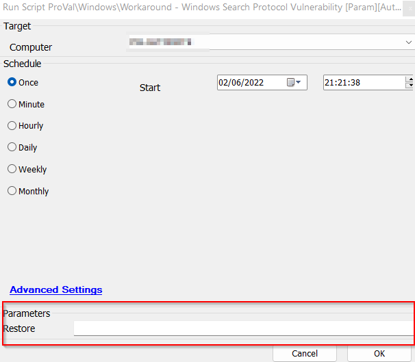
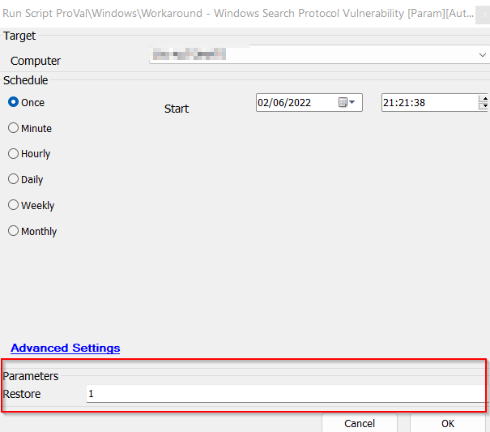

## Summary

This script backs up and removes or restores the following registry key:  
**HKEY_CLASSES_ROOT/search-ms**  
**Key backup location:**  
`C:/Windows/LTSvc/Packages/SearchMSRegDirectory`  

This script is automatically executed by the “[ProVal - Development - Workaround - Windows Search Protocol Vulnerability [G]](/docs/d097987d-79c7-4a2f-a57a-ed959c676b20)” Monitor.

This script can also be run manually. It will give you the option to pass the value for the parameter "Restore" if you run it manually. The "HKEY_CLASSES_ROOT/search-ms" key will be restored if the argument is set to 1. The script's default behavior is to attempt to export and delete the registry file. The script can create a ticket for failure as well, but to enable the ticketing feature, you need to update the value of the Global Variable Ticket to 1. The script's default behavior is to not generate any ticket.

Apart from this, it saves the final result to a script state, "Search-MS Registry Status," to display the data in the “[Windows Search Protocol Registry Key Audit [Script][Role]](/docs/838ecfa5-0526-4c5d-845a-be4f21898c86)” dataview.

Additionally, the script will import all the contents of the solution for its first run.

## Sample Run

Leave the Restore field blank to remove the registry key:  
  

Set the Restore to 1 for restoring the registry keys:  
  

## Dependencies

- [Search-MS Registry Key](/docs/174939f4-d7d5-4c92-9813-308db2c2b0c3)
- [ProVal - Development - Workaround - Windows Search Protocol Vulnerability [G]](/docs/d097987d-79c7-4a2f-a57a-ed959c676b20)
- [Windows Search Protocol Vulnerability - Workarounds](/docs/4af66a7d-ddf7-485c-b284-b73a2a5d2de1)

## Variables

| Name     | Description                                                                                     |
|----------|-------------------------------------------------------------------------------------------------|
| OutCome  | Store the output of the PowerShell scripts being executed to perform the necessary action.     |
| Tickid   | Variable for retrieving and storing the ticket ID of an existing failure ticket.                |

#### Global Parameters

| Name     | Example    | Required | Description                                                  |
|----------|------------|----------|--------------------------------------------------------------|
| Ticketid | 1 or 0    | False    | Set it to 1 to make the script create tickets for the failures. |

#### User Parameters

| Name     | Example                   | Required | Description                     |
|----------|---------------------------|----------|---------------------------------|
| Restore  | 1 or leave it blank       | False    | 1 to use the script to restore the key |

#### Script States

| Name                       | Example                                    | Description                             |
|----------------------------|--------------------------------------------|-----------------------------------------|
| search-ms Registry Status  | Backed Up And Removed, Failed to Remove, Restored, Failed to Restore | Outcome of the recent operation performed |

## Process

**Step 1:** Imports all the parts to the solution.  
**Step 2:** Checks if it is called to restore or to remove the registry key.  

### For Backup and Restore.

**Step 1:** Clears the script state, "Search-MS Registry Status."  
**Step 2:** Executes the PowerShell script to take the backup of the registry key and to remove the key.  
**Step 3:** Verifies the outcome of the PowerShell and proceeds accordingly.  
**Step 4:** For success, it will set the script state as "Backed Up And Removed," and exit.  
**Step 5:** For failure, it will set the script state as "Failed to Remove," and check whether ticket creation is enabled or not.  
**Step 6:** If ticket creation is enabled, it will look for the already existing ticket and add a comment to that; otherwise, it will create a ticket if the ticket does not exist.  
**Step 7:** Exit with success for success and exit with failure for any failures.  

### For Restore.

**Step 1:** Clears the script state, "Search-MS Registry Status."  
**Step 2:** Executes the PowerShell script to restore the key.  
**Step 3:** Verifies the outcome of the PowerShell and proceeds accordingly.  
**Step 4:** For success, it will set the script state as "Restored" and exit.  
**Step 5:** For failure, it will set the script state as "Failed to Restore," and check whether ticket creation is enabled or not.  
**Step 6:** If ticket creation is enabled, it will look for the already existing ticket and add a comment to that; otherwise, it will create a ticket if the ticket does not exist.  
**Step 7:** Exit with success for success and exit with failure for any failures.  

## Output

- Script log
- Script state
- Ticket
- Dataview

