## Purpose

This table is a manually updated table that will display Windows operating systems support end date, build number, and their respective release if any.

References:
- [Microsoft Windows | endoflife.date](https://endoflife.date/windows)
- [Windows 10 version history - Wikipedia](https://en.wikipedia.org/wiki/Windows_10_version_history)
- [Windows 11 version history - Wikipedia](https://en.wikipedia.org/wiki/Windows_11_version_history)
- [Microsoft Windows Server | endoflife.date](https://endoflife.date/windows-server)

## Dependencies

[CWM - Automate - Script - MySQL - Table - Create (plugin_proval_windows_os_support)](https://proval.itglue.com/DOC-5078775-11564131)

## Table

#### plugin_proval_windows_os_support

| Column                     | Type    | Explanation                                                                 |
|---------------------------|---------|-----------------------------------------------------------------------------|
| BaseOS                    | varchar | The name of the operating system                                            |
| ReleaseID                 | varchar | The Windows 10 Build number/name associated with the Build column          |
| Build                     | varchar | The version of Windows associated with the ReleaseID column                |
| ReleaseDate               | date    | The date the version was released                                          |
| SupportMainstreamEnd      | date    | The date the version will no longer be supported for Mainstream devices    |
| SupportEnterpriseEnd       | date    | The date the version will no longer be supported for Enterprise devices     |
| SupportLTSBEnd           | date    | The date the version will no longer be supported for LTSB devices.         |

## FAQ

Q. I need to add more versions to this list how do I do that?  
A. Open the [CWM - Automate - Script - MySQL - Table - Create (plugin_proval_windows_os_support)](https://proval.itglue.com/DOC-5078775-11564131) script and modify line 1 to add the new item.

## For CW RMM

**THE PROVIDED STEPS MUST ONLY BE FOLLOWED AFTER ADDING A NEW ENTRY IN THE AUTOMATE'S CUSTOM TABLE.**  
**READ THE PROVIDED STEPS BEFORE MAKING ANY CHANGES OR STARTING EDITING.**  
**DO NOT PROCEED WITH THE EDITING IF YOU HAVE ANY DOUBTS WITH ANY OF THE PROVIDED STEPS.**

We cannot create a custom table or store this data in a tabular form in CW RMM. To overcome this limitation of CW RMM, we are using a public ITGlue article to store this data and using a PowerShell script to compare the Support End Date.

Please follow these instructions carefully to update the information stored in this article for CW RMM: [CW RMM - Custom Table - Windows OS Support Date](https://proval.itglue.com/DOC-5078775-15739309)

1. Open the article in a new tab.  
   Here is a screenshot of currently stored data in the article:  
   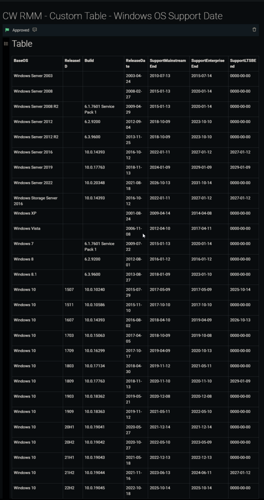  
   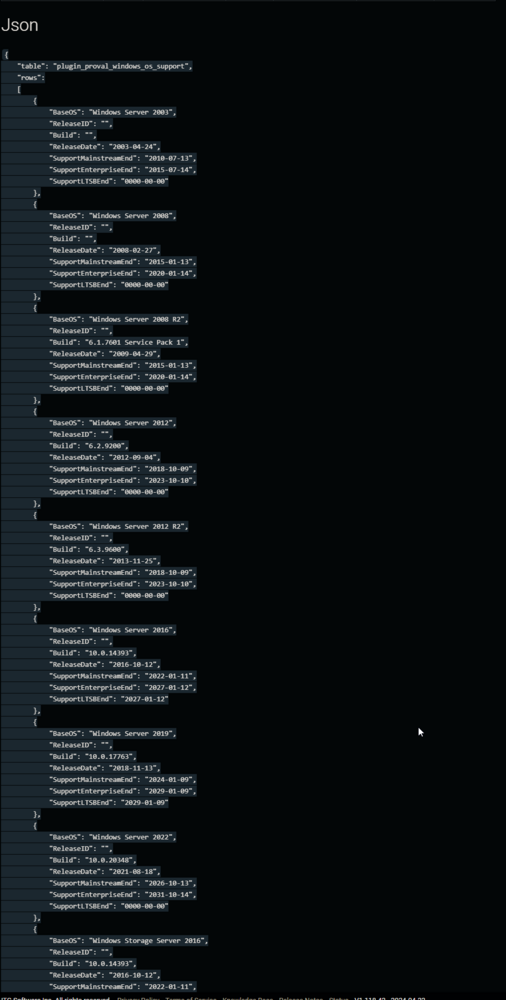  
   The document contains further information. These screenshots are attached to explain that the data stored in the article are in two different forms: `Table` and `JSON`.

2. Click the `Edit` button.  
   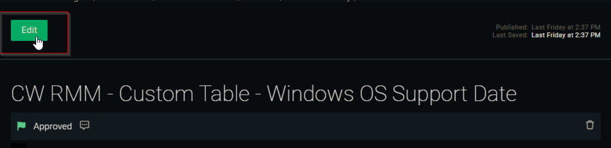  

3. Click `Edit` to start editing the document.  
   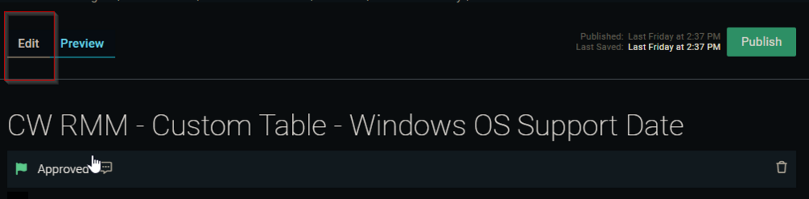  

4. Connect to our internal database from a `Heidi SQL` client and execute this SQL query.  
   ```
   SELECT * FROM plugin_proval_windows_os_support
   ```  
   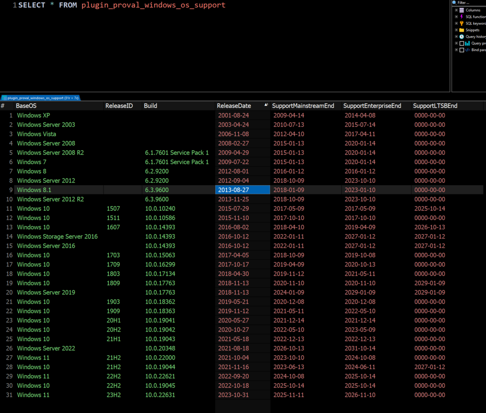  

5. Press `Ctrl + A` in the result section to select all rows.  
   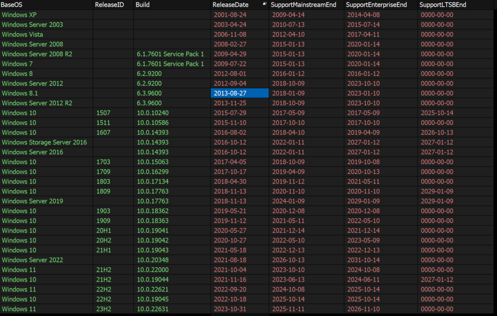  

6. Right-click anywhere in the selected section.  
   - Hover your cursor over the `Copy As` option and click on the `HTML table` option.  
   This will give you the data to store in the `Table` section of the document.  
   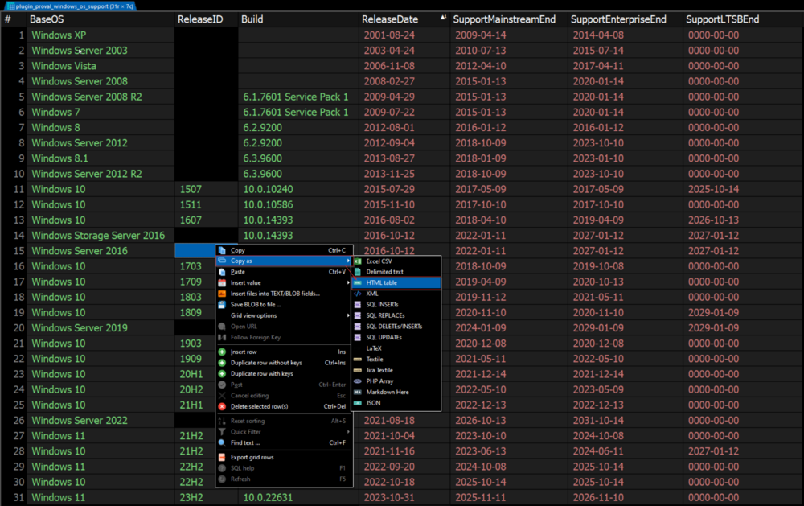  

7. Remove the tabular data from the ITGlue document.  
   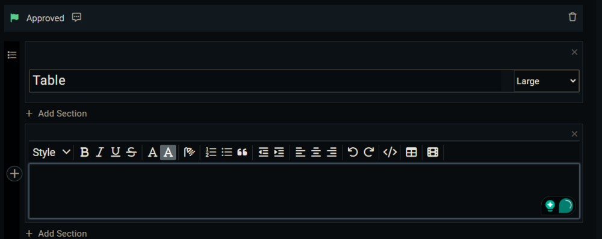  

8. Paste the `HTML Table` data in this blank section that was copied in `Step 6`.  
   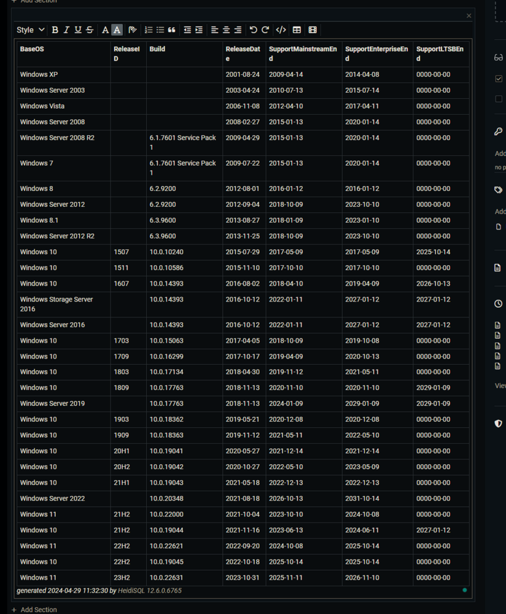  

9. Remove the `generated by HeidiSQL` comment from the bottom of the table.  
   Before Removal:  
   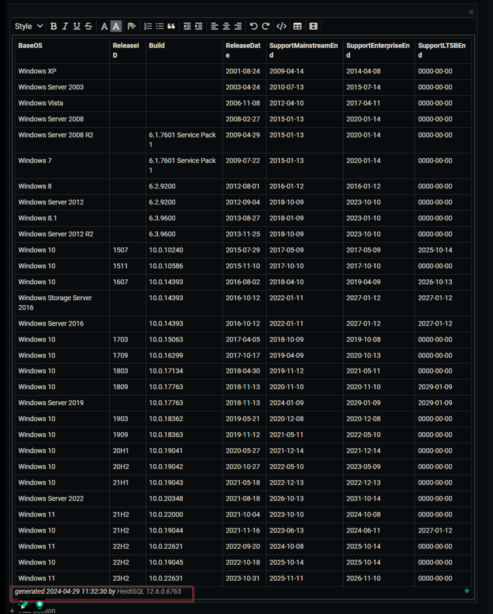  
   After Removal:  
   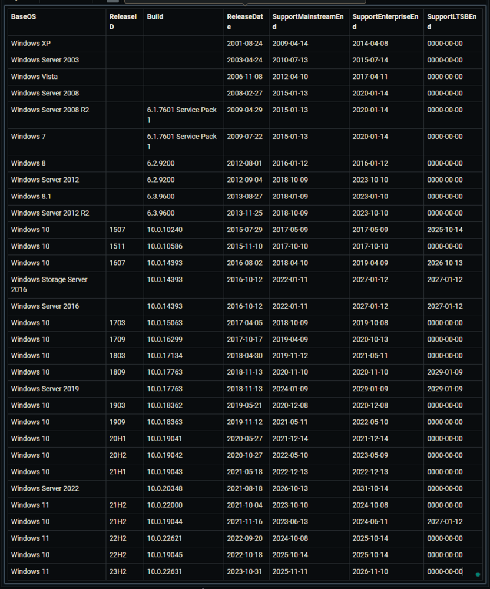  

10. Now we are going to update the `JSON` added to the document in the same way.  

11. Go back to the `Heidi SQL`.  

12. Copy the data as `JSON`.  
   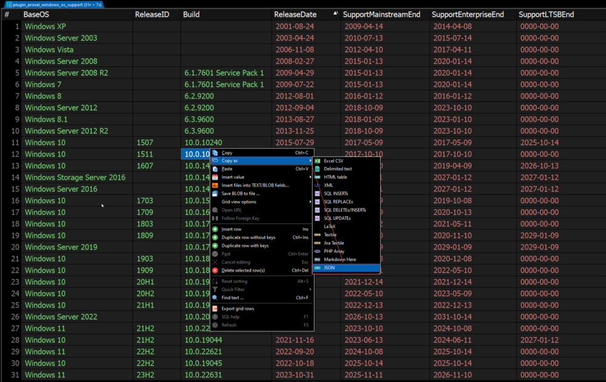  

13. Remove everything stored in the `JSON` section of the document.  
   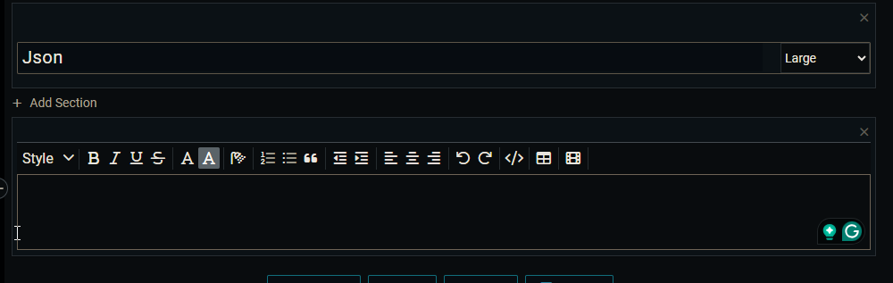  

14. Paste the `JSON` data in this blank section that was copied in `Step 12`.  
   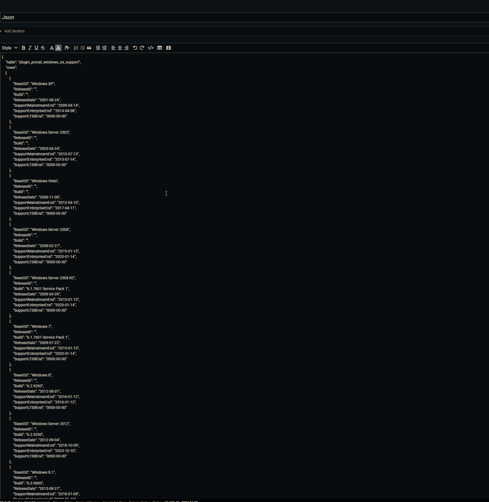  

15. Scroll to the bottom of the document.  

16. Click anywhere in the `JSON` section.  

17. Press `Ctrl + A` on your keyboard to select the stored `JSON` content.  

18. The formatting option will appear at the bottom left.  
   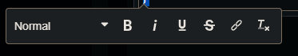  

19. Select the `Code` option from the formatting dropdown menu.  
   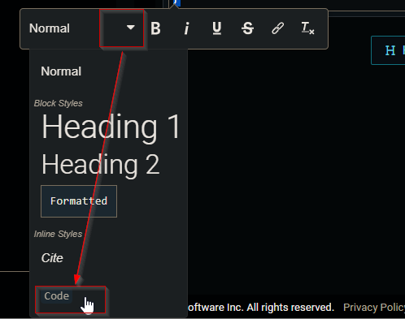  

20. Scroll to the top of the document and click the `Publish` button to save the changes.  
   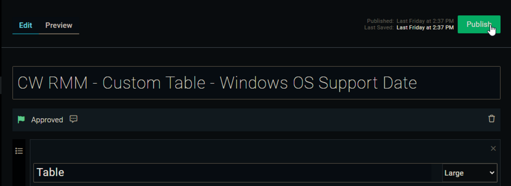  


