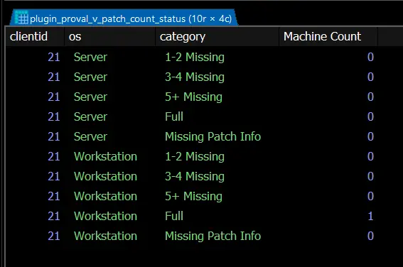

## Purpose

This view provides a client-level breakdown of machines missing a certain number of patches.

Sample data:  

## Dependencies

[CWM - Automate - Script - MySQL - View - Create - Plugin_ProVal_V_Patch_Count_Status](/docs/7b802d5b-f445-41d6-b3e4-30986c3102a0)

## Tables

#### plugin_proval_v_patch_count_status

| Column        | Type       | Explanation                                                                                   |
|---------------|------------|-----------------------------------------------------------------------------------------------|
| clientid     | int(11)    | Client ID                                                                                     |
| os            | varchar(11)| Operating System (Workstation | Server)                                                     |
| category      | varchar(18)| Category Name (Full | 1-2 Missing | 3-4 Missing | 5+ Missing | Missing Patch Info)      |
| Machine Count | int(5)     | Number of machines falling under the concerned category for the client.                      |
