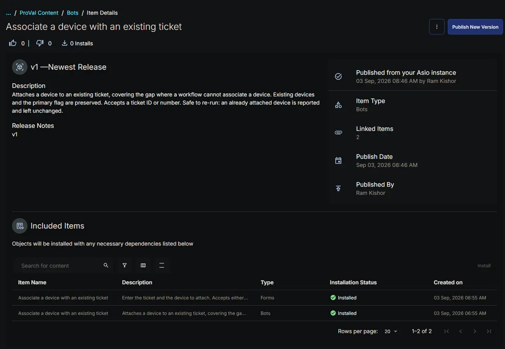

## Summary

The **Associate a device with an existing ticket** bot attaches a device to a ticket that already exists. It covers the single capability a native CW RMM workflow lacks: a workflow can create a ticket, note it and close it, but it cannot associate a device with it.

The bot runs inside the platform, so it uses the pre-authenticated RPA HTTP client and needs no client ID or client secret. The base URL arrives automatically through the `cwOpenAPIURL` input.

**How it works:**

1. Both form values are read and written to the result log before validation, so a single run shows exactly what the form delivered.
2. The ticket is resolved. A value matching the GUID pattern is fetched directly by ID; anything else is treated as a ticket number and searched for. A GUID that fails a direct fetch also falls back to the number search.
3. After a number search the ticket is re-read by ID, because the search projection is not guaranteed to include the complete `assets` array.
4. The existing associations are merged with the incoming device.
5. The merged array is written back with a JSON Patch `replace` operation.
6. The patch response is inspected to confirm the device is present before the run is reported as successful.
7. `ticketId`, `ticketNumber`, `deviceId`, `assetCount`, `isPrimary` and `alreadyAssociated` are returned as result data for bot chaining.

**Why the ticket is read before it is written**

The ticket API supports only the `replace` operation on the `assets` path, which means the entire array has to be sent back on every change. Sending just the new device would silently remove every device already associated with the ticket, and would also discard the primary flag. Reading first and merging avoids both.

**Merge behaviour**

| Ticket state | Outcome |
| ------------ | ------- |
| Has a device flagged primary | The new device is appended as an additional device; the existing primary is untouched |
| Has no devices at all | The new device is attached and becomes the primary |
| Has devices but none flagged primary | The new device is attached and becomes the primary |
| Already has this device | No patch is sent; the run reports success and changes nothing |

That last row makes the bot safe to re-run. A retried or duplicated workflow step will not create a duplicate association or fail the run.

**API endpoints used**

| Method | Endpoint | Purpose |
| ------ | -------- | ------- |
| GET | `/api/platform/v2/service/ticketing/tickets/{ticketId}` | Fetch the ticket by ID and read its current assets |
| GET | `/api/platform/v2/service/ticketing/tickets?number={number}` | Resolve a ticket number to a ticket ID |
| PATCH | `/api/platform/v2/service/ticketing/tickets/{ticketId}` | Replace the assets array with the merged list |

## Details

| Bot Name | Description | Execution Environment |
| -------- | ----------- | --------------------- |
| Associate a device with an existing ticket | Attaches a device to an existing ticket, covering the gap where a workflow cannot associate a device. Existing devices and the primary flag are preserved. Accepts a ticket ID or number. Safe to re-run: an already attached device is reported and left unchanged. | Cloud |

## Integration Configuration

| Platform | Platform Scopes | 3rd Party Apps | Integrations |
| -------- | --------------- | -------------- | ------------ |
| True | <ul><li>`Platform - Tickets - Read`</li><li> `Platform - Devices - Read`</li><li> `Platform - Sites - Read`</li><li> `Platform - Assets - Read`</li><li> `Platform - Companies - Read`</li><li> `Platform - Tickets - Create`</li><li> `Platform - Tickets - Update`</li></ul> | False |  |

## Form Setup

| Form Required | Form Template |
| ------------- | ------------- |
| Yes | [Forms: Associate a device with an existing ticket](/docs/45135ca2-b3f8-4d0e-9331-ef89768b487b) |

## Functions

- [app.py](https://github.com/ProVal-Tech/cw-rmm/blob/main/bots/associate-a-device-with-an-existing-ticket/app.py)
- [conda.yaml](https://github.com/ProVal-Tech/cw-rmm/blob/main/bots/associate-a-device-with-an-existing-ticket/conda.yaml)
- [formSchema.json](https://github.com/ProVal-Tech/cw-rmm/blob/main/bots/associate-a-device-with-an-existing-ticket/formschema.json)

## Forms Setup Path

- **Tasks Path:** `Automation` ➞ `Bots`

## Dependencies

- [Forms: Associate a device with an existing ticket](/docs/45135ca2-b3f8-4d0e-9331-ef89768b487b)

The bot cannot run without its form, which supplies the ticket and the device.

**Consumed by:**

- [CWRMM Ticket Management for Monitors](/docs/57daa951-2acc-4be7-a025-0d0ca729ef57)

**Related content:**

- [Bots: Create ticket with associated device](/docs/cf8a2c3d-456c-4567-8039-97e89f894ac5) — creates a ticket and attaches a device in one operation, rather than attaching to an existing ticket.

## Implementation

Install the bot from the `ProVal - Content` Community, selecting the **Bots** repository. After installation the following configuration steps are mandatory.



### 1. Configure the platform scopes

Open the bot's **Basic Details** screen and enable the Platform integration with the scopes listed under [Integration Configuration](#integration-configuration). A missing scope surfaces as an HTTP 403 on the ticket fetch or the patch, and the result log names which call failed.

### 2. Attach the form and verify the variable names

Attach the [Forms: Associate a device with an existing ticket](/docs/45135ca2-b3f8-4d0e-9331-ef89768b487b) form, then confirm each variable name in the form matches its entry in the `FORM_FIELDS` dictionary in `app.py`:

```python
FORM_FIELDS = {
    "TicketId": "TicketId_1788381088829",
    "DeviceId": "DeviceId_1788381114402",
}
```

Field variable names carry a numeric suffix generated when the field is created, so recreating a field changes its name. The bot falls back to matching on the field title when the variable name does not resolve, but the variable name is the primary lookup and should be corrected.

### 3. Publish the bot

The bot must be published or activated before it can be executed from the Automation Pod or referenced by a workflow.

### 4. Position the bot step in the workflow

Place the bot step immediately after the action that creates or retrieves the ticket, and map:

- **TicketId** ➞ the ticket ID or ticket number output by the preceding ticket action.
- **DeviceId** ➞ the endpoint ID already resolved earlier in the workflow.

Both inputs are required and neither can be derived from the other, so both must be mapped.

**Primary Note: Reading the bot output**

Progress and failure detail are written to the result log, which is what appears when bot logs are directed to a ticket. The run logs the values the form delivered, the resolved ticket ID and number, and the asset count before and after the change. If a run fails with no detail beyond the exception, the form data itself did not arrive.

**Primary Note: TicketId delivery**

If the result log reports that no value reached the bot for `TicketId`, the input was not delivered by the workflow. Confirm the step maps it. If the mapping is present and the value still does not arrive, the field name may be colliding with the workflow's own ticket context; rename the form field to something such as `TargetTicket` and update `FORM_FIELDS` to match.

**Primary Note: Undocumented asset flag**

The `isPrimary` property on a ticket asset is not present in the published platform API schema, which documents only the asset `id`. Its behaviour was confirmed against live ticket responses. The bot reads the existing flag and writes it back unchanged, so if a future API change alters that behaviour, devices will still be associated correctly but the primary flag may not be preserved.

## Changelog

### 2026-09-03

- Initial version of the document
