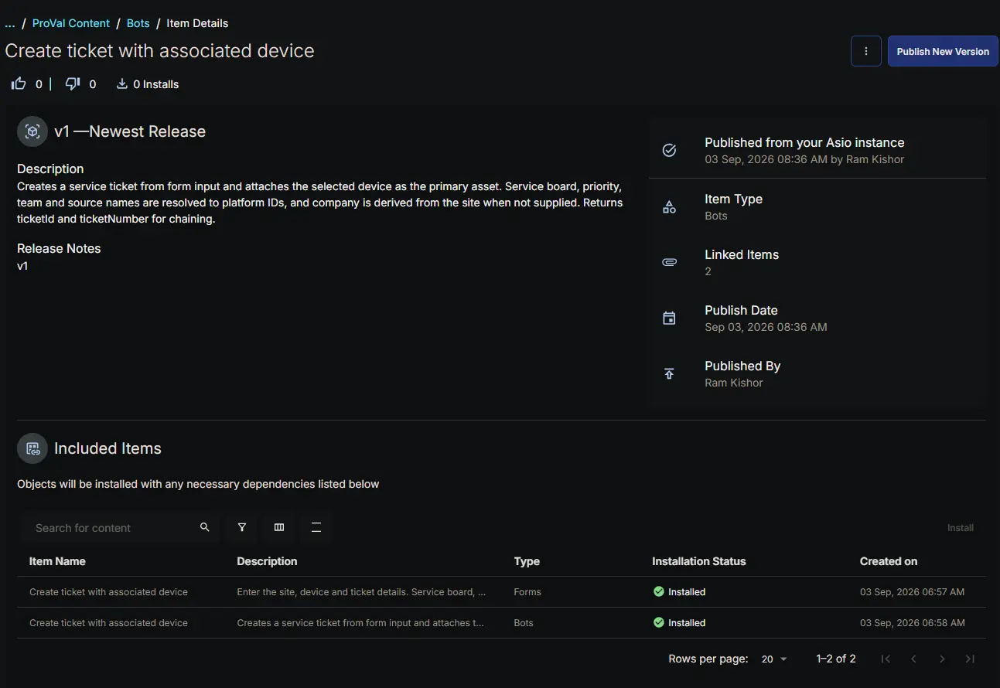

## Summary

The **Create ticket with associated device** bot creates a service ticket and attaches a device to it in a single operation. It exists because a native CW RMM workflow can create a ticket but cannot associate a device with it.

The bot runs inside the platform, so it uses the pre-authenticated RPA HTTP client and needs no client ID or client secret. The base URL arrives automatically through the `cwOpenAPIURL` input.

**How it works:**

1. All eight form values are read and written to the result log before any of them are validated, so a single run shows exactly what the form delivered.
2. The company and site are resolved against the platform inventory. When `CompanyId` is blank, the site is matched against the full site list and the company is read from the parent company that the site record carries.
3. The service board, priority and source names are resolved to their GUIDs. The board lookup is filtered by company and site so only entitled boards are considered, falling back to the full partner list if the platform rejects that filter.
4. If a team was supplied, it is resolved against the teams of the selected service board.
5. The ticket is created with the device in its `assets` array, flagged as the primary asset.
6. `ticketId`, `ticketNumber` and `deviceId` are returned as result data for bot chaining.

**Why names are resolved at runtime**

The GUIDs for service boards, priorities, sources and teams are not exposed anywhere in the CW RMM interface, so a form cannot reasonably ask for them. The bot resolves the display names instead. Matching is case-insensitive and inactive records are skipped. When a name does not match, the error lists every valid name for that lookup, so one failed run identifies the correct value.

**Identifier flexibility**

Platform company and site identifiers are synthetic GUIDs that encode a legacy Command ID. The bot accepts the platform GUID, the bare numeric Command ID, an external product ID, or the display name for either field, and normalises whatever it receives to the identifier the ticket API expects.

**API endpoints used**

| Method | Endpoint | Purpose |
| ------ | -------- | ------- |
| GET | `/api/platform/v1/company/companies` | Resolve `CompanyId` when it is supplied |
| GET | `/api/platform/v1/company/companies/{companyId}/sites` | Resolve `SiteId` within that company |
| GET | `/api/platform/v1/company/sites` | Resolve `SiteId` and derive the parent company when `CompanyId` is blank |
| GET | `/api/platform/v1/service/ticketing/service-boards` | Resolve the service board name |
| GET | `/api/platform/v1/service/ticketing/priorities` | Resolve the priority name |
| GET | `/api/platform/v1/service/ticketing/sources` | Resolve the ticket source name |
| GET | `/api/platform/v1/service/ticketing/service-boards/{id}/teams` | Resolve the team name on the selected board |
| POST | `/api/platform/v2/service/ticketing/tickets` | Create the ticket with the device attached |

## Details

| Bot Name | Description | Execution Environment |
| -------- | ----------- | --------------------- |
| Create ticket with associated device | Creates a service ticket from form input and attaches the selected device as the primary asset. Service board, priority, team and source names are resolved to platform IDs, and company is derived from the site when not supplied. Returns ticketId and ticketNumber for chaining. |  Cloud |

## Integration Configuration

| Platform | Platform Scopes | 3rd Party Apps | Integrations |
| -------- | --------------- | -------------- | ------------ |
| True | <ul><li>`Platform - Tickets - Read`</li><li> `Platform - Devices - Read`</li><li> `Platform - Sites - Read`</li><li> `Platform - Assets - Read`</li><li> `Platform - Companies - Read`</li><li> `Platform - Tickets - Create`</li><li> `Platform - Tickets - Update`</li></ul> | False |  |

## Form Setup

| Form Required | Form Template |
| ------------- | ------------- |
| Yes | [Forms: Create ticket with associated device](/docs/8d147440-f887-4c21-8fc8-fb93c0d54c29) |

## Functions

- [app.py](https://github.com/ProVal-Tech/cw-rmm/blob/main/bots/create-ticket-with-associated-device/app.py)
- [conda.yaml](https://github.com/ProVal-Tech/cw-rmm/blob/main/bots/create-ticket-with-associated-device/conda.yaml)
- [formSchema.json](https://github.com/ProVal-Tech/cw-rmm/blob/main/bots/create-ticket-with-associated-device/formschema.json)

## Forms Setup Path

- **Tasks Path:** `Automation` ➞ `Bots`

## Dependencies

- [Forms: Create ticket with associated device](/docs/8d147440-f887-4c21-8fc8-fb93c0d54c29)

The bot cannot run without its form, which supplies every value it operates on.

**Related content:**

- [Bots: Associate a device with an existing ticket](/docs/b98f159a-f34a-4c4c-8ff3-b89a0d003219) — attaches a device to a ticket that already exists, rather than creating one.

## Implementation

Install the bot from the `ProVal - Content` Community, selecting the **Bots** repository. After installation the following configuration steps are mandatory.



### 1. Set the ticket source

The platform requires a source on every ticket, but the form does not collect one. The source name is set as a constant near the top of `app.py`:

```python
TICKET_SOURCE_NAME = "Alerting"
```

Change this to the name of a source that exists on your partner. To discover the valid names, run the bot once with a deliberately wrong value; the failure message lists every active source.

### 2. Configure the platform scopes

Open the bot's **Basic Details** screen and enable the Platform integration with the scopes listed under [Integration Configuration](#integration-configuration). A missing scope surfaces as an HTTP 403 on the corresponding lookup, and the result log names which lookup failed.

### 3. Attach the form and verify the variable names

Attach the [Forms: Create ticket with associated device](/docs/8d147440-f887-4c21-8fc8-fb93c0d54c29) form, then confirm each variable name in the form matches its entry in the `FORM_FIELDS` dictionary in `app.py`:

```python
FORM_FIELDS = {
    "CompanyId": "CompanyId_1788375309113",
    "SiteId": "SiteId_1788375359068",
    "DeviceId": "DeviceId_1788375274379",
    "TicketSubject": "TicketSubject_1788375503396",
    "TicketBody": "TicketBody_1788375531740",
    "ServiceBoard": "ServiceBoard_1788375398837",
    "Priority": "Priority_1788375463074",
    "Team": "Team_1788375434406",
}
```

Field variable names carry a numeric suffix generated when the field is created, so recreating a field changes its name. The bot falls back to matching on the field title when the variable name does not resolve, but the variable name is the primary lookup and should be corrected.

### 4. Publish the bot

The bot must be published or activated before it can be executed from the Automation Pod or referenced by a workflow.

### 5. Map every input in the calling workflow

When called from a workflow, each form field appears as a bot step input and must be mapped explicitly. An unmapped input is delivered as an empty value, not as a default. `CompanyId` is the exception — it may be left unmapped, and the bot will derive the company from the site.

**Primary Note: Reading the bot output**

Progress and failure detail are written to the result log, which is what appears when bot logs are directed to a ticket. Every resolution step is logged with the value it received and the GUID it resolved to, so a failure shows exactly how far the run progressed. If a run fails with no detail beyond the exception, the form data itself did not arrive — the first logged line reports every value the form delivered.

**Primary Note: Undocumented asset flag**

The `isPrimary` property on a ticket asset is not present in the published platform API schema, which documents only the asset `id`. Its behaviour was confirmed against live ticket responses. If a future API change alters that behaviour, the device will still be attached but the primary flag may not be honoured.

## Changelog

### 2026-09-03

- Initial version of the document
