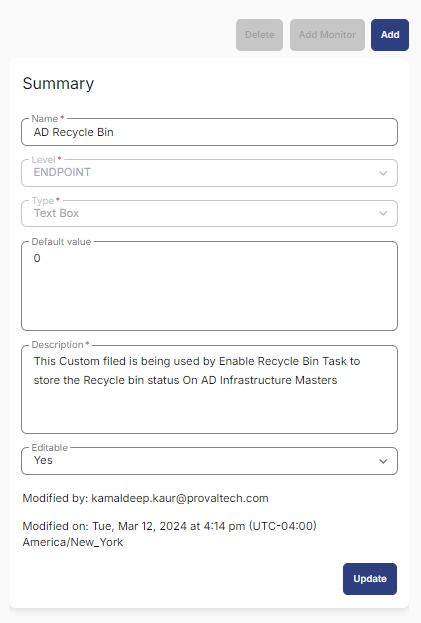

## Summary

The [Task - Enable AD Recycle Bin](<../tasks/Enable AD Recycle Bin.md>) utilizes this custom field to store information regarding the AD Recycle Bin status. It will indicate whether it is enabled or if the infrastructure master does not meet the minimum criteria.

## Create the Custom Field

**Name:** AD Recycle Bin  
**Type:** Text Box  
**Level:** Endpoint  
**Default Value:** 0  
**Description:** This custom field is used by the Enable Recycle Bin Task to store the Recycle Bin status on AD Infrastructure Masters.  
**Editable:** Yes  

