## Summary

This company-level custom field stores the parameter to install the Cisco Secure Client package using the [SWM - Software Install - Task - Cisco Secure Client Package Installation (Windows)](https://proval.itglue.com/DOC-5078775-15148224) task.

Parameters must be set in a manner consistent with the agnostic script [SWM - Software Install - Agnostic - Install-CiscoSecureClient](https://proval.itglue.com/DOC-5078775-11897620).

## Dependencies

[SWM - Software Install - Task - Cisco Secure Client Package Installation (Windows)](https://proval.itglue.com/DOC-5078775-15148224)

## Details

| Field Name                      | Type of Field | Description                                                                                                                                                     |
|---------------------------------|----------------|-----------------------------------------------------------------------------------------------------------------------------------------------------------------|
| Cisco Secure Client Parameter    | Company        | Stores the parameter to install the Cisco Secure Client package using the Cisco Secure Client Package Installation (Windows) task. How to use parameters: [https://proval.itglue.com/DOC-5078775-11897620](https://proval.itglue.com/DOC-5078775-11897620) |

## ScreenShot

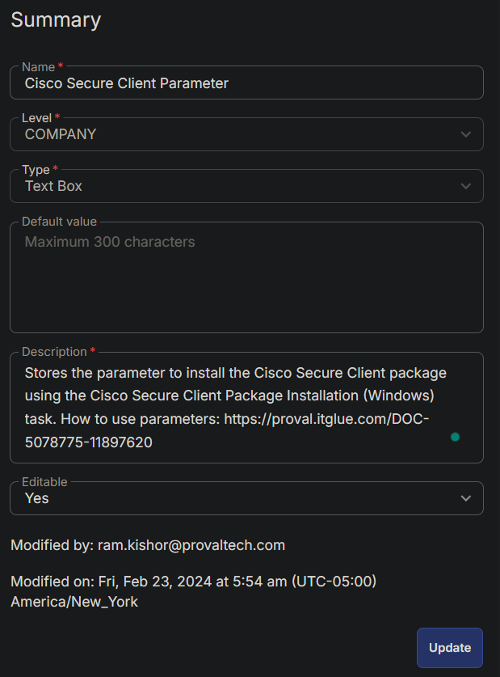

## How to use the Custom Field

- Navigate to Client Management > Company Management  
  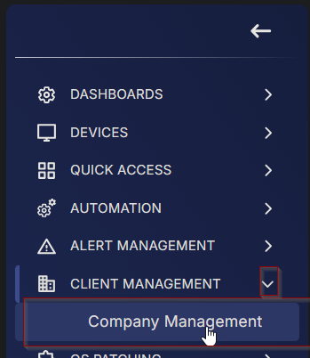
  
- Select the desired client from the Company List  
  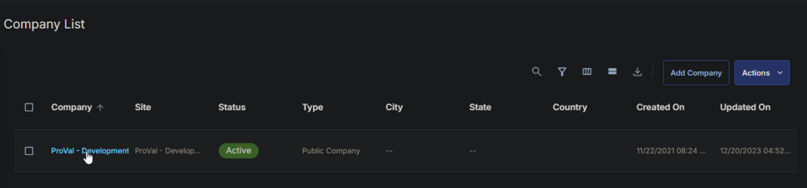
  
- Go to `Custom Fields` section in the Company Details  
  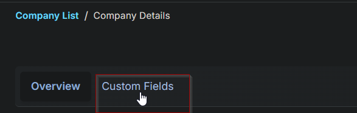  
  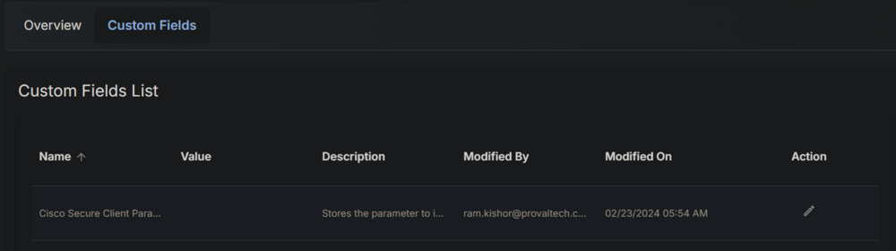
  
- Click the `edit` button for the `Cisco Secure Client Parameter` Custom Field  
  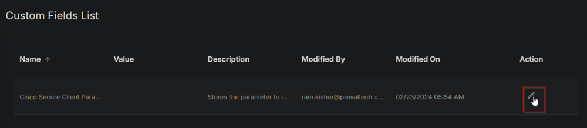
  
- This pop-up will appear on the screen  
  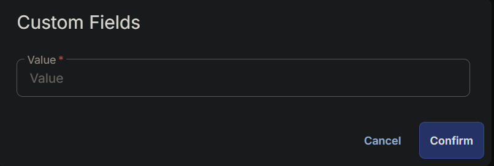
  
- Write the required parameter in the `Value` text box and click the `Confirm` button to save.  
  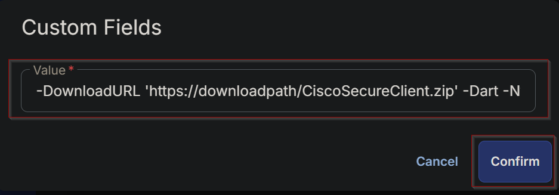

## Sample Values

**Value:**  
```
-DownloadURL 'https://downloadpath/CiscoSecureClient.zip' -core -Umbrella -UserID 1234567 -Fingerprint oash098ashuiue -OrgId 394058
```
**Outcome:**  
The Task will install the Core VPN (keeping it hidden from the end-user) and Umbrella Modules. Because Umbrella is being installed, the UserID, Fingerprint, and OrgId are required. Also, it's mandatory to install the Core VPN module to install the Umbrella module.  
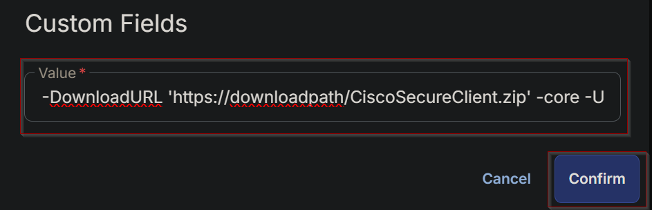

**Value:**  
```
-DownloadURL 'https://downloadpath/CiscoSecureClient.zip' -Dart -Nvm -Posture
```
**Outcome:**  
The task will install the Diagnostics and Reporting, VPN Posture (HostScan), and Network Visibility Modules.  


**Value:**  
```
-DownloadURL 'https://downloadpath/CiscoSecureClient.zip' -core -Umbrella -Dart -Nvm -UserID 1234567 -Fingerprint oash098ashuiue -OrgId 394058
```
**Outcome:**  
The Task will install the Core VPN module (keeping it hidden from the end-user), Umbrella, Diagnostics and Reporting, and Network Visibility Modules. Because Umbrella is being installed, the UserID, Fingerprint, and OrgId are required.  


**Value:**  
```
-DownloadURL 'https://downloadpath/CiscoSecureClient.zip' -core -ShowVPN -Umbrella -Dart -Nvm -UserID 1234567 -Fingerprint oash098ashuiue -OrgId 394058
```
**Outcome:**  
The task will install the Core VPN module (Visible to the end-user in the system tray icon), Umbrella, Diagnostics and Reporting, and Network Visibility Modules. Because Umbrella is being installed, the UserID, Fingerprint, and OrgId are required.  
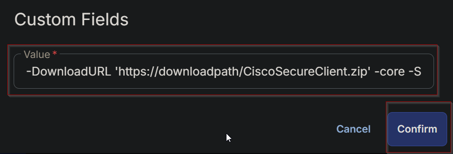

**Value:**  
```
-DownloadURL 'https://downloadpath/CiscoSecureClient.zip' -All -UserID 1234567 -Fingerprint oash098ashuiue -OrgId 394058
```
**Outcome:**  
The task will install all Modules, including Umbrella, which require the UserID, Fingerprint, and OrgId to be provided. Programmatically creates a JSON authentication file for access by the Umbrella module.  
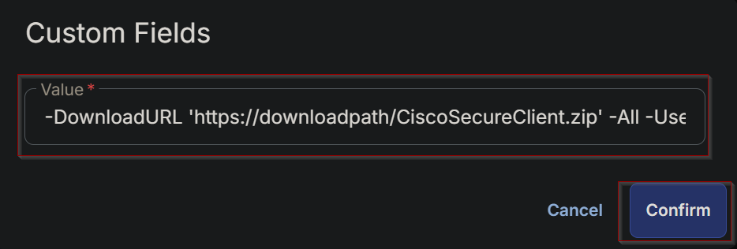

**Note:**  
The DownloadURL, FingerPrint, OrgID, and UserID provided above are for illustrative purposes only. When executing the script, it is essential to set the correct values for these parameters according to the specific requirements.

## Agnostic Script Parameters

Different installation Parameters can be created by using these parameters from the agnostic script.  

| Parameter      | Required | Default | Type   | Parameter Set Members | Description                                                                                       |
|----------------|----------|---------|--------|-----------------------|---------------------------------------------------------------------------------------------------|
| All            | False    |         | Switch | All                   | Installs All modules. Requires Dynamic Params                                                     |
| UserID         | True     |         | String | Dynamic: All, Umbrella| Cisco Client ID: Required for Umbrella and All Switches.                                        |
| FingerPrint    | True     |         | String | Dynamic: All, Umbrella| Cisco Fingerprint: Required for Umbrella and All switches.                                      |
| orgID          | True     |         | String | Dynamic: All, Umbrella| Cisco Org ID: Required for Umbrella and All Switches.                                           |
| core           | False    |         | Switch | Custom                | Installs the Core-VPN module.                                                                     |
| showVPN        | False    |         | Switch | Dynamic: All, core    | Displays Core-VPN module in the system tray icon                                                 |
| SBL            | False    |         | Switch | Custom                | Installs the Start Before Login module.                                                          |
| DART           | False    |         | Switch | Custom                | Installs the Diagnostic And Reporting Tool module.                                               |
| NVM            | False    |         | String | Custom                | Installs the Network Visibility module.                                                           |
| NAM            | False    |         | String | Custom                | Installs the Network Access Manager module.                                                       |
| Posture        | False    |         | String | Custom                | Installs the VPN Posture (HostScan) module.                                                     |
| ISEPosture     | False    |         | String | Custom                | Installs the ISE Posture module.                                                                  |
| Umbrella       | False    |         | String | Custom                | Installs the Umbrella module. Requires Dynamic Params                                            |
| DownloadURL    | True     |         | String | Core, All, Custom, Umbrella | URL to download the [CiscoSecureClient.zip](http://ciscosecureclient.zip/) file.                 |


