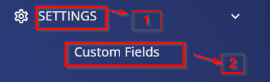
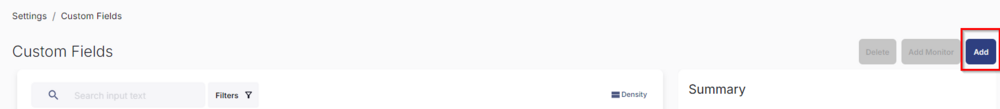
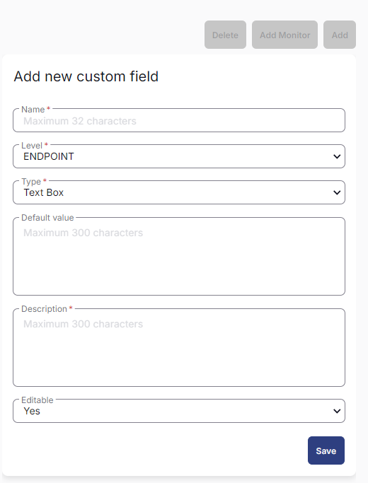
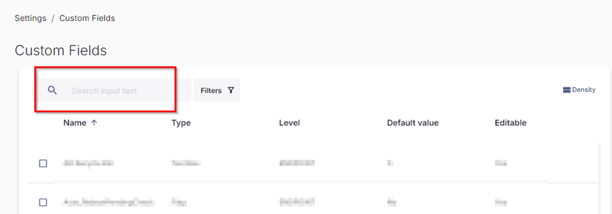

## Summary

The custom fields described here are used in the creation of [Dynamic Groups - Browser Saved Password](https://proval.itglue.com/DOC-5078775-17312581) and used in the [Task - Clear/Audit - Browser Saved Password](https://proval.itglue.com/DOC-5078775-17309286).

## Dependencies

- [Dynamic Groups - Browser Saved Password](https://proval.itglue.com/DOC-5078775-17312581)
- [Task - Clear/Audit - Browser Saved Password](https://proval.itglue.com/DOC-5078775-17309286)

## Details

| Field Name                               | Level    | Type  | Default | Editable | Description                                                                                                                                                                 |
|------------------------------------------|----------|-------|---------|----------|-----------------------------------------------------------------------------------------------------------------------------------------------------------------------------|
| Browser Saved Pwd Audit Only             | Endpoint | Flag  | No      | Yes      | This will allow the [Task - Clear/Audit - Browser Saved Password](https://proval.itglue.com/DOC-5078775-17309286) to Audit only on the endpoint.                          |
| Browser Saved Pwd Audit Only             | Company  | Flag  | No      | Yes      | This field will allow the [Task - Clear/Audit - Browser Saved Password](https://proval.itglue.com/DOC-5078775-17309286) to audit only rather than deleting it on the endpoints of the company. |
| Exclude Browser Saved Pwd Audit          | Endpoint | Flag  | No      | Yes      | This will exclude the endpoint from executing [Task - Clear/Audit - Browser Saved Password](https://proval.itglue.com/DOC-5078775-17309286).                             |
| Exclude Browser Saved Pwd Audit          | Site     | Flag  | No      | Yes      | This will exclude the site endpoints from executing the [Task - Clear/Audit - Browser Saved Password](https://proval.itglue.com/DOC-5078775-17309286).                   |
| Clear Browser Saved Pwd                  | Company  | Flag  | No      | Yes      | This will allow the [Task - Clear/Audit - Browser Saved Password](https://proval.itglue.com/DOC-5078775-17309286) to perform the saved password clearance from the browsers on company endpoints. |
| Clear Browser Saved Pwd                  | Endpoint | Flag  | No      | Yes      | This will allow the [Task - Clear/Audit - Browser Saved Password](https://proval.itglue.com/DOC-5078775-17309286) to perform the saved password clearance from the browsers of the endpoint. |
| Exclude Clear Browser Saved Pwd          | Site     | Flag  | No      | Yes      | This will deny the [Task - Clear/Audit - Browser Saved Password](https://proval.itglue.com/DOC-5078775-17309286) to perform the saved password clearance from the browsers of the site endpoints. |
| Exclude Clear Browser Saved Pwd          | Endpoint | Flag  | No      | Yes      | This will deny the [Task - Clear/Audit - Browser Saved Password](https://proval.itglue.com/DOC-5078775-17309286) to perform the saved password clearance from the browsers of the endpoint. |
| Browser Saved Pwd Audit Data             | Endpoint | Text  |         | No       | This stores the audit result of the [Task - Clear/Audit - Browser Saved Password](https://proval.itglue.com/DOC-5078775-17309286).                                      |

## Implementation

1. Navigate to the Settings -> Custom Fields:  
   

2. Click on the "Add" button once the Custom Fields is opened.  
   

3. After clicking add it will provide you the below fields to be filled:  
   

4. Feed the values provided above one by one and save the custom fields.  
   Once the custom fields are created, please validate them by searching them in the search input text field option provided in the custom fields:  
     
   It will show you the custom fields created by you.

