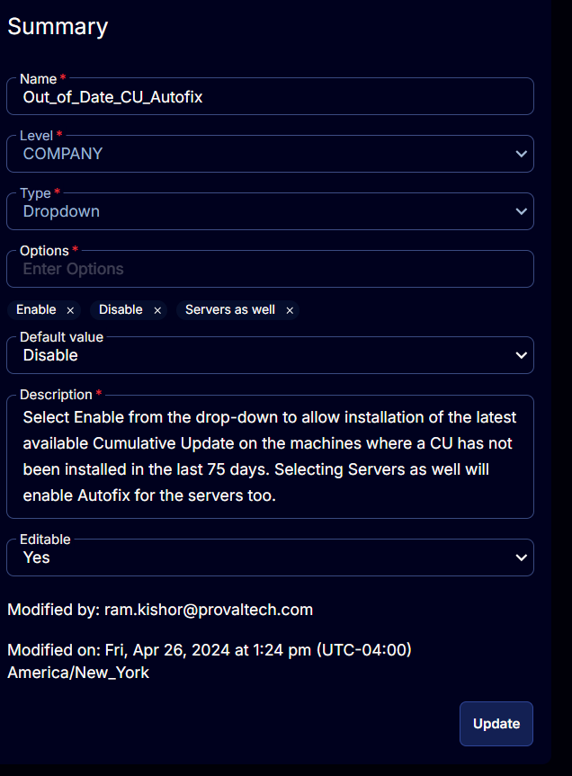

## Summary

A drop-down Custom Field to manage the Autofix section for the [CW RMM - Solution - Latest Cumulative Update Audit](https://proval.itglue.com/DOC-5078775-14029448) solution. Select Enable from the drop-down to allow installation of the latest available Cumulative Update on the machines where a CU has not been installed in the last 75 days. Selecting Servers as well will enable Autofix for the servers too.

## Details

| Field Name                  | Level   | Type     | Options                                   | Default Value | Description                                                                                                                                                         | Editable |
|-----------------------------|---------|----------|-------------------------------------------|---------------|---------------------------------------------------------------------------------------------------------------------------------------------------------------------|----------|
| Out_of_Date_CU_Autofix     | COMPANY | Dropdown | `Enable`, `Disable`, `Servers as well`   | Disable       | Select Enable from the drop-down to allow installation of the latest available Cumulative Update on the machines where a CU has not been installed in the last 75 days. Selecting Servers as well will enable Autofix for the servers too. | Yes      |

## Options

| Option            | Description                                                                                                                                                       |
|-------------------|-------------------------------------------------------------------------------------------------------------------------------------------------------------------|
| Enable            | To enable the Autofix for the Company. Enabling the Autofix will enable the Autofix for the Workstations only. It can be overridden from the Site and Endpoint level. |
| Disable           | To disable the Autofix for the Company. It can be overridden from the Site and Endpoint level.                                                                    |
| Servers as well   | To enable the Autofix for Servers too. Selecting this option will enable the Autofix (Auto installation of latest Cumulative Update) for Servers as well. It can be overridden from the Site and Endpoint level. |

## ScreenShot

