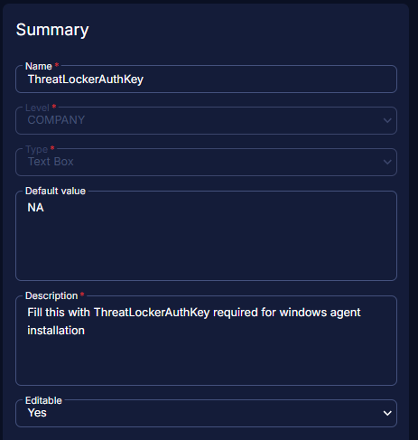

## Summary

This custom field at the company level stores the ThreatLocker Authorization Key for Windows machines.  
[Getting your Unique Identifier from ThreatLocker | ThreatLocker Help Center](https://threatlocker.kb.help/getting-your-unique-identifier-from-threatlocker/)

## Dependencies

[CW RMM - Solution - ThreatLocker Deployment](<../../solutions/Threatlocker Deployment.md>)

## Details

| Field Name             | Level  | Type     | Default Value | Description                                        | Editable |
|-----------------------|--------|----------|---------------|----------------------------------------------------|----------|
| ThreatLockerAuthKey   | Company| TextBox  | NA            | ThreatLocker Authorization Key for Windows machines.| Yes      |

## Screenshot

