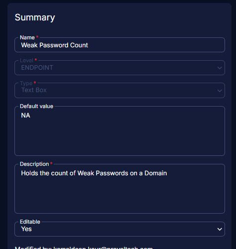

## Summary

Holds the count of accounts with weak passwords

## Dependencies

[CW RMM - Solution - Weak Passwords Audit](https://proval.itglue.com/DOC-5078775-17872310)

## Details

| Field Name           | Level    | Type    | Default Value | Description                                   | Editable |
|----------------------|----------|---------|---------------|-----------------------------------------------|----------|
| Weak Password Count   | Endpoint | Textbox | NA            | Holds the count of Weak Passwords on a Domain | Yes      |

## ScreenShot

