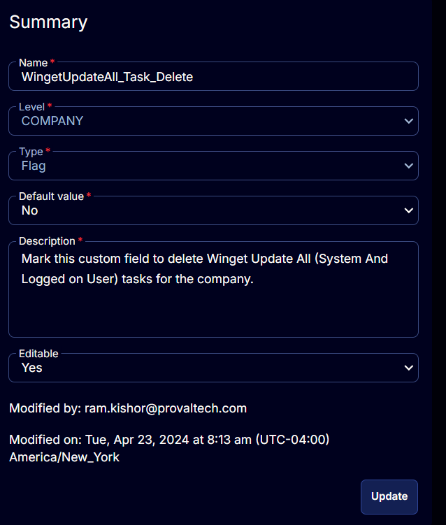

## Summary

Mark this custom field to delete Winget Update All (System and Logged on User) tasks for Windows 10 and 11 machines in the company.

Marking this custom field will automatically add the machines to the [CW RMM - Machine Group - Winget Update All (Task Delete)](<../groups/Winget Update All (Task Delete).md>) group.

## Details

| Field Name                       | Level  | Type | Default Value | Description                                                                 | Editable |
|----------------------------------|--------|------|---------------|-----------------------------------------------------------------------------|----------|
| WingetUpdateAll_Task_Delete      | COMPANY| Flag | No            | Mark this custom field to delete Winget Update All (System and Logged on User) tasks for the company. | Yes      |

## Screenshots

