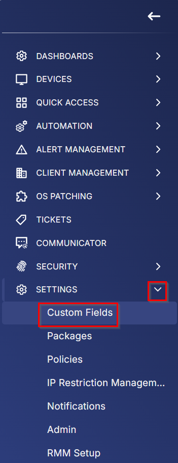
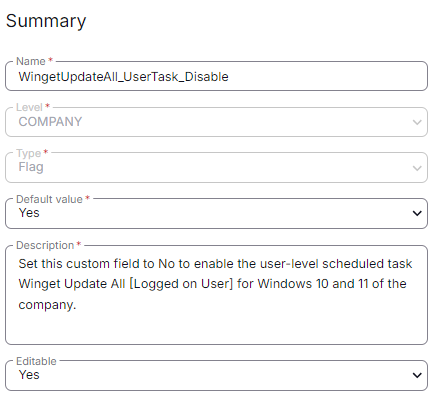

## Summary

Set this custom field to "No" to enable the user-level scheduled task `Winget Update All [Logged on User]` for Windows 10 and 11 in the company.

The [CW RMM - Task - Scheduled Task Winget Update All (Create)](<../tasks/Scheduled Task Winget Update All (Create).md>) task will not enable the user-level Winget to update all scheduled tasks by default, as it is set to "Yes".

## Details

| Field Name                              | Level  | Type | Default Value | Description                                                                                                                                       | Editable |
|-----------------------------------------|--------|------|---------------|---------------------------------------------------------------------------------------------------------------------------------------------------|----------|
| WingetUpdateAll_UserTask_Disable       | COMPANY| Flag | Yes           | Set this custom field to "No" to enable the user-level scheduled task `Winget Update All [Logged on User]` for Windows 10 and 11 in the company. | Yes      |

## Screenshots

