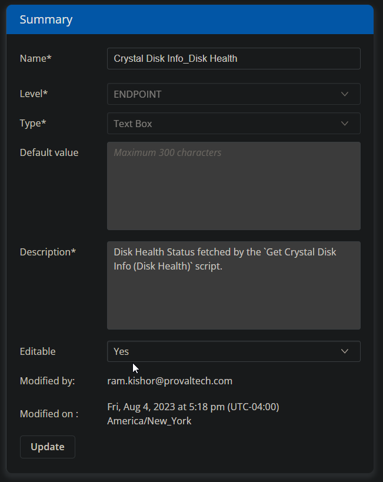
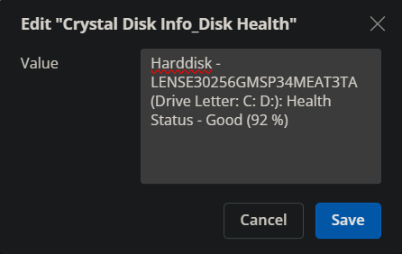

## Summary

This custom field is used to store and display the results of the [CW RMM - Task - Get Crystal Disk Info (Disk Health)](https://proval.itglue.com/DOC-5078775-13549879) task.

## Dependencies

[CW RMM - Task - Get Crystal Disk Info (Disk Health)](https://proval.itglue.com/DOC-5078775-13549879)

## Details

| Field Name                         | Type of Field (Machine or Organization) | Description                                                                                     |
|------------------------------------|-----------------------------------------|-------------------------------------------------------------------------------------------------|
| Crystal Disk Info_Disk Health      | Machine                                 | Disk Health Status fetched by the [Get Crystal Disk Info (Disk Health)](https://proval.itglue.com/DOC-5078775-13549879) script. |

## ScreenShot

## Sample Value

