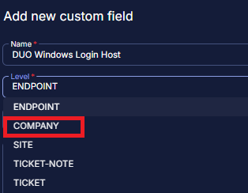
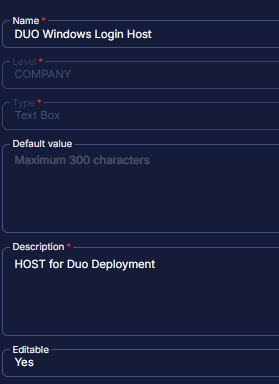

## Summary

These custom fields are required for the "Duo Authentication for Windows Logon" deployment.

## Dependencies

## Details

| Name                        | Level    | Type  | Required | Editable | Default Value? | Description                                                                                                                                                                                                                     |
|-----------------------------|----------|-------|----------|----------|----------------|---------------------------------------------------------------------------------------------------------------------------------------------------------------------------------------------------------------------------------|
| DUO Autopush Ovrr          | Endpoint | Text  | False    | Yes      | \<Blank>        | If set to "Yes," this option will automatically send a push request to the endpoint when the user attempts to log in. The default value is blank, requiring the user to request the push manually. Note: It overrides the company's custom field value. |
| DUO Autopush Server        | Company  | Text  | False    | Yes      | No             | If set to "Yes," this option automatically sends a push request to the company servers when the user attempts to log in. The default value is No, requiring the user to request the push manually.                                 |
| DUO Autopush Wks           | Company  | Text  | False    | Yes      | No             | If set to "Yes," this option will automatically send a push request to the company workstations when the user attempts to log in. The default value is No, requiring the user to request the push manually.                       |
| DUO EnableOffline Ovrr     | Endpoint | Text  | False    | Yes      | \<Blank>        | If set to "Yes", it will control whether offline access is permitted on the endpoint. Note: The default value is blank. It overrides the company's custom field value.                                                              |
| DUO EnableOffline Server    | Company  | Text  | False    | Yes      | No             | If set to "Yes", it will control whether offline access is permitted on servers. In the context of Duo, offline access allows users to authenticate without a real-time connection to Duo’s service, usually by using previously generated passcodes or other offline authentication methods. |
| DUO EnableOffline Wks      | Company  | Text  | False    | Yes      | No             | If set to "Yes", it will control whether offline access is permitted on workstations. In the context of Duo, offline access allows users to authenticate without a real-time connection to Duo’s service, usually by using previously generated passcodes or other offline authentication methods. |
| DUO Failopen Ovrr         | Endpoint | Text  | False    | Yes      | \<Blank>        | This determines the behavior when Duo’s service cannot be reached. If set to "Yes", the system will allow the user to log in to the endpoint (fail open). If set to No or left blank, the system will deny access (fail closed). Note: It overrides the company's custom field value. |
| DUO FailOpen Server        | Company  | Text  | False    | Yes      | No             | This determines the behavior when Duo’s service cannot be reached. If set to "Yes", the system will allow the user to log in on company servers (fail open). If set to No or left blank, the system will deny access (fail closed). The default is to fail to open. |
| DUO FailOpen Wks          | Company  | Text  | False    | Yes      | No             | This determines the behavior when Duo’s service cannot be reached. If set to "Yes", the system will allow the user to log in on company workstations (fail open). If set to No or left blank, the system will deny access (fail closed). The default is to fail to open. |
| DUO RDPOnly Ovrr          | Endpoint | Text  | False    | Yes      | \<Blank>        | When set to "Yes", Duo authentication is required only for remote logins via RDP on the endpoint. The default is blank, meaning Duo protects both. Note: It overrides the company's custom field value.                           |
| DUO RDPOnly Server         | Company  | Text  | False    | Yes      | No             | When set to "Yes", Duo authentication is required only for remote logins via RDP on company servers. If set to No or left blank, Duo authentication is required for both console and RDP logins. The default is No, meaning Duo protects both. |
| DUO RDPOnly Wks           | Company  | Text  | False    | Yes      | No             | When set to "Yes", Duo authentication is required only for remote logins via RDP on company workstations. If set to No or left blank, Duo authentication is required for both console and RDP logins. The default is No, meaning Duo protects both. |
| DUO SmartCard Ovrr        | Endpoint | Text  | False    | Yes      | \<Blank>        | If set to "Yes", it allows smart card login as an alternative to Duo authentication on the endpoint. The default is blank, which does not allow smart card login without Duo approval. Note: It overrides the company's custom field value. |
| DUO Smartcard Server       | Company  | Text  | False    | Yes      | No             | If set to "Yes", it allows smart card login as an alternative to Duo authentication on company servers. If set to No or left blank, it disables the Windows smart card provider. The default is No, which does not allow smart card login without Duo approval. |
| DUO Smartcard Wks         | Company  | Text  | False    | Yes      | No             | If set to "Yes", it allows smart card login as an alternative to Duo authentication on company workstations. If set to No or left blank, it disables the Windows smart card provider. The default is No, which does not allow smart card login without Duo approval. |
| DUO Windows Login Host     | Company  | Text  | True     | Yes      | \<Blank>        | HOST Key for Duo Deployment                                                                                                                                                                                                         |
| Duo Windows Login IKEY     | Company  | Text  | True     | Yes      | \<Blank>        | IKEY Key for Duo Deployment                                                                                                                                                                                                         |
| Duo Windows Login SKEY     | Company  | Text  | True     | Yes      | \<Blank>        | SKEY Key for Duo Deployment                                                                                                                                                                                                         |
| Duo Deployment             | Company  | Flag  | False    | Yes      | No             | If this checkbox is set then the agents of the company will be added to the group for the DUO deployment. Note: Any agent with the "DUO Deployment Exclude" custom field selected will be excluded.                             |
| Duo Deployment Exclude     | Endpoint | Flag  | False    | Yes      | No             | If this checkbox is set then the agent will be excluded from the group for the DUO deployment.                                                                                                                                   |
| DUO Deployment Result      | Endpoint | Text  | False    | No       | \<Blank>        | This stores the DUO Deployment result of "Success" or "Failure" based on the script "DUO Install & Upgrade - Latest Version" result.                                                                                          |

## Steps to Create Custom Fields

1. Go to Settings > Custom Fields  
   

2. Click Add option  
   

3. Create Custom Field  
   Provide Name: DUO Windows Login Host  
   Select Level: Company  
     
   Then check the Type option:  
   Type: Text Box  
     
   Then Provide Default Value and Description:  
   Default:  
   Description: HOST for Duo Deployment  
   Editable: Yes  
     
   Note: Description is mandatory to be filled and it doesn't accept **'NEW LINE'**. Write everything in one phrase to describe the detail of the custom field.

4. Please follow the same step to create other custom fields.

