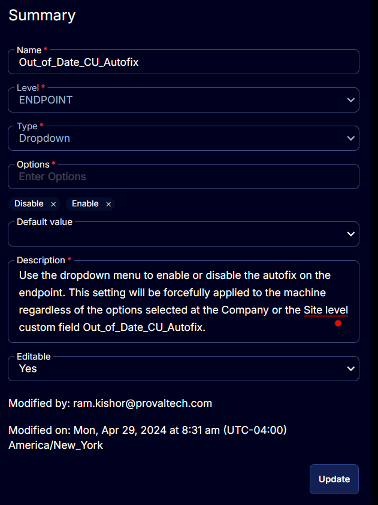

## Summary

Use the dropdown menu to enable or disable the autofix on the endpoint. This setting will be forcefully applied to the machine regardless of the options selected in the Company or Site level custom field `Out_of_Date_CU_Autofix`.

## Details

| Field Name                  | Level    | Type      | Options                    | Default Value | Description                                                                                                                                                                                                                                               | Editable |
|-----------------------------|----------|-----------|----------------------------|---------------|-----------------------------------------------------------------------------------------------------------------------------------------------------------------------------------------------------------------------------------------------------------|----------|
| Out_of_Date_CU_Autofix     | ENDPOINT | Dropdown  | `Disable`, `Enable`       |               | Use the dropdown menu to enable or disable the autofix on the endpoint. This setting will be forcefully applied to the machine regardless of the options selected in the Company or Site level custom field `Out_of_Date_CU_Autofix`.                     | Yes      |

## Options

| Option  | Description                                                                                                                                                                                                                                                |
|---------|------------------------------------------------------------------------------------------------------------------------------------------------------------------------------------------------------------------------------------------------------------|
| Disable | Disables the Autofix for the particular endpoint. It can be used to override the options selected in the company and site level custom field `Out_of_Date_CU_Autofix`.                                                                                 |
| Enable  | Enables the Autofix for the particular endpoint. It can be used to override the options selected in the company and site level custom field `Out_of_Date_CU_Autofix`.                                                                                 |

## Screenshots

  
  

