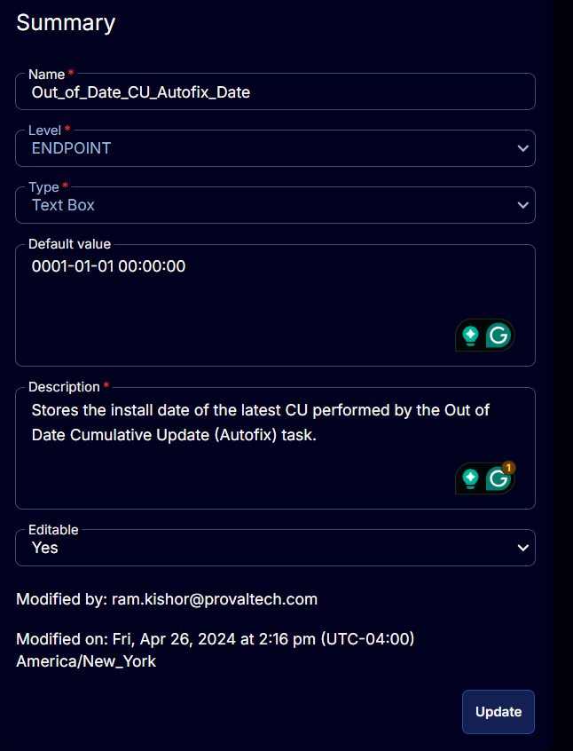

## Summary

Stores the install date of the latest CU performed by the Out of Date Cumulative Update (Autofix) task.

## Details

| Field Name                      | Level    | Type      | Default Value         | Description                                                                 | Editable |
|---------------------------------|----------|-----------|-----------------------|-----------------------------------------------------------------------------|----------|
| Out_of_Date_CU_Autofix_Date    | ENDPOINT | Text Box  | 0001-01-01 00:00:00  | Stores the install date of the latest CU performed by the Out of Date Cumulative Update (Autofix) task. | Yes      |

## ScreenShot

  
  

