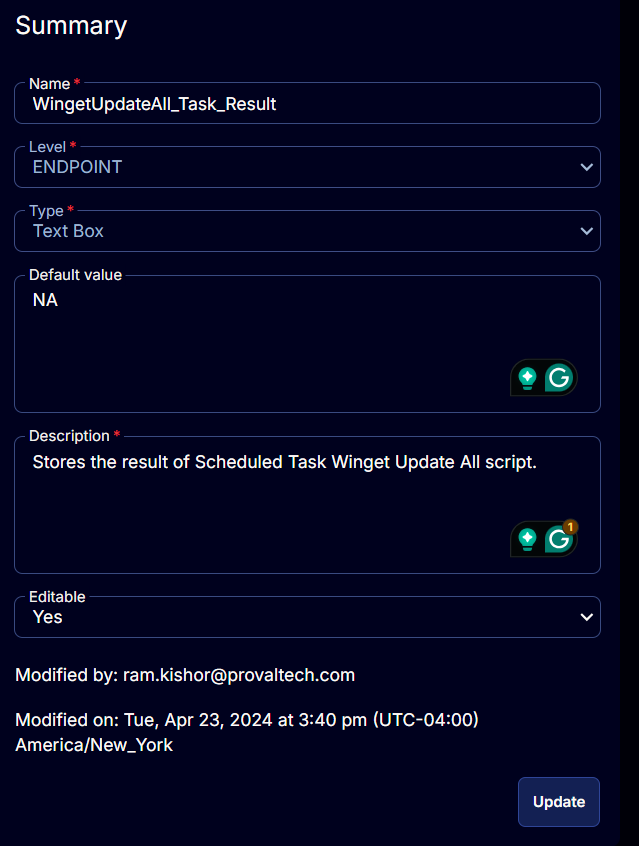

## Summary

This custom field stores the outcome of both [CW RMM - Task - Scheduled Task Winget Update All (Create)](https://proval.itglue.com/DOC-5078775-15702931) and [CW RMM - Task - Scheduled Task Winget Update All (Delete)](https://proval.itglue.com/DOC-5078775-15702855) tasks. It stores whether the task succeeded or failed.

Possible values:
- NA
- Task Created
- Task Creation Failed
- Task Deleted
- Task Deletion Failed

## Details

| Field Name                          | Level    | Type      | Default Value | Description                                         | Editable |
|-------------------------------------|----------|-----------|---------------|-----------------------------------------------------|----------|
| WingetUpdateAll_Task_Result         | ENDPOINT | Text Box  | NA            | Stores the result of Scheduled Task Winget Update All script. | Yes      |

## ScreenShot

