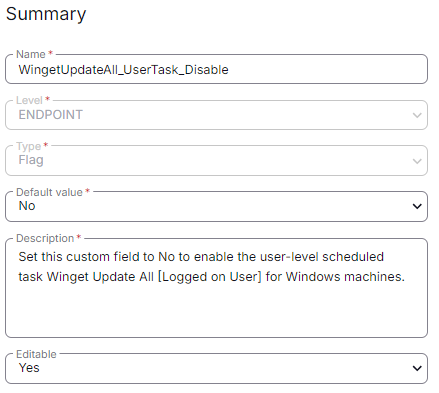

## Summary

Set this custom field to "No" to enable the user-level scheduled task `Winget Update All [Logged on User]` for Windows machines.

[CW RMM - Task - Scheduled Task Winget Update All (Create)](https://proval.itglue.com/DOC-5078775-15702931) task will not enable the user-level Winget to update all scheduled tasks by default as it is set to "Yes".

## Details

| Field Name                             | Level    | Type | Default Value | Description                                                                                                           | Editable |
|----------------------------------------|----------|------|---------------|-----------------------------------------------------------------------------------------------------------------------|----------|
| WingetUpdateAll_UserTask_Disable      | ENDPOINT | Flag | No            | Set this custom field to "Yes" to disable the user-level scheduled task `Winget Update All [Logged on User]` for Windows 10 and 11 of the Windows Machines. | Yes      |

## ScreenShot

