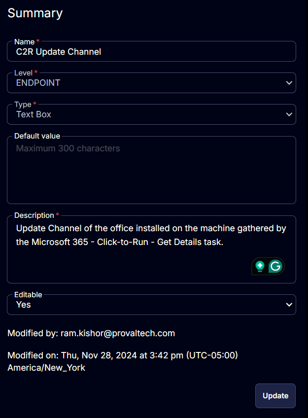

## Summary

This document explains how to update the channel of the Office installed on a machine, gathered by the [Microsoft 365 - Click-to-Run - Get Details](https://proval.itglue.com/DOC-5078775-17917390) task.

## Details

| Field Name          | Level    | Type     | Default Value | Description                                                                 | Editable |
|---------------------|----------|----------|---------------|-----------------------------------------------------------------------------|----------|
| C2R Update Channel   | Endpoint | Text Box |               | Update Channel of the Office installed on the machine, gathered by the Microsoft 365 - Click-to-Run - Get Details task. | Yes      |

## Screenshots

