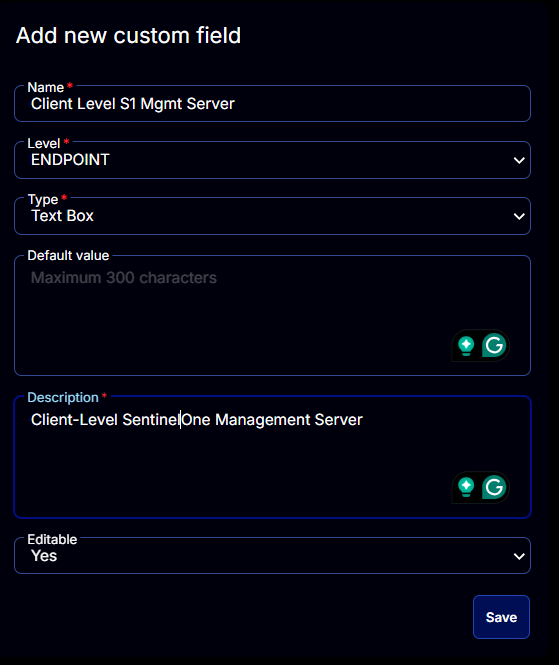

## Summary

Client Level SentinelOne Management Server. Updated by [SentinelOne Management Console Validation](<../tasks/SentinelOne Management Console Validation.md>) task.

## Dependencies

[CW RMM - Task - SentinelOne Management Console Validation](<../tasks/SentinelOne Management Console Validation.md>)

## Details

| Field Name                      | Level    | Type      | Default Value | Description                                | Editable |
|---------------------------------|----------|-----------|---------------|--------------------------------------------|----------|
| Client Level S1 Mgmt Server     | ENDPOINT | Text Box  | No            | Client Level SentinelOne Management Server.| Yes      |

## Screenshots

