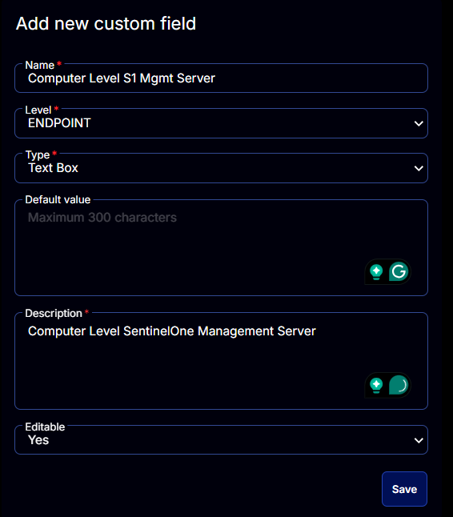

## Summary

Computer Level SentinelOne Management Server. Updated by the [SentinelOne Management Console Validation](<../tasks/SentinelOne Management Console Validation.md>) task.

## Dependencies

[CW RMM - Task - SentinelOne Management Console Validation](<../tasks/SentinelOne Management Console Validation.md>)

## Details

| Field Name                       | Level    | Type      | Default Value | Description                                 | Editable |
|----------------------------------|----------|-----------|---------------|---------------------------------------------|----------|
| Computer Level S1 Mgmt Server    | ENDPOINT | Text Box  | No            | Computer Level SentinelOne Management Server. | Yes      |

## Screenshots

  

