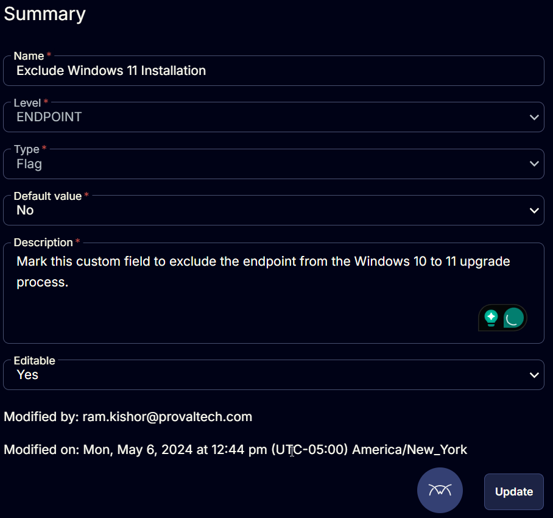

## Summary

Mark this custom field to exclude the endpoint from the Windows 10 to 11 upgrade process.

## Details

| Field Name                        | Level   | Type  | Default Value | Description                                                                 | Editable |
|-----------------------------------|---------|-------|---------------|-----------------------------------------------------------------------------|----------|
| Exclude Windows 11 Installation    | Endpoint| Flag  | No            | Mark this custom field to exclude the endpoint from the Windows 10 to 11 upgrade process. | Yes      |

## Screenshot

  

