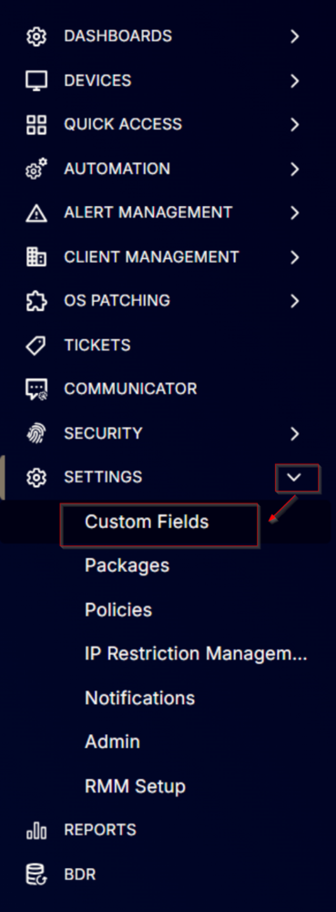
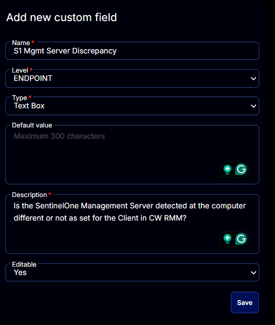

## Summary

Is the SentinelOne Management Server detected at the computer different from what is set for the Client in CW RMM? Updated by [SentinelOne Management Console Validation](<../tasks/SentinelOne Management Console Validation.md>) task.

## Dependencies

[CW RMM - Task - SentinelOne Management Console Validation](<../tasks/SentinelOne Management Console Validation.md>)

## Details

| Field Name                       | Level    | Type      | Default Value | Description                                                                                       | Editable |
|----------------------------------|----------|-----------|---------------|---------------------------------------------------------------------------------------------------|----------|
| S1 Mgmt Server Discrepancy      | ENDPOINT | Text Box  | No            | Is the SentinelOne Management Server detected at the computer different from what is set for the Client in CW RMM? | Yes      |

## Screenshots

