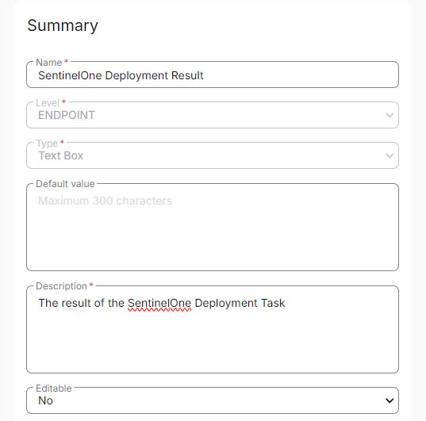

## Summary

This custom field stores the result of [CW RMM - Task - SentinelOne Deployment](https://proval.itglue.com/DOC-5078775-15806354).

## Dependencies

[CW RMM - Solution - SentinelOne Deployment](https://proval.itglue.com/DOC-5078775-15822040).

## Details

| Field Name                        | Level    | Type     | Default Value | Description                                   | Editable |
|-----------------------------------|----------|----------|---------------|-----------------------------------------------|----------|
| SentinelOne Deployment Result      | Endpoint | TextBox  |               | The result of the SentinelOne Deployment Task | No       |

## Screenshot

