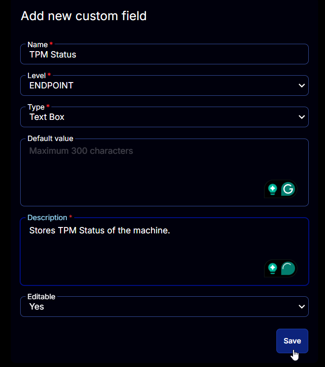

## Summary

Stores TPM Status of the machine. Updated by [Get TPM Status](<../tasks/Get TPM Status.md>) task.

## Dependencies

[CW RMM - Task - Get TPM Status](<../tasks/Get TPM Status.md>)

## Details

| Field Name   | Level    | Type      | Default Value | Description                          | Editable |
|--------------|----------|-----------|---------------|--------------------------------------|----------|
| TPM Status   | ENDPOINT | Text Box  | No            | Stores TPM Status of the machine.    | Yes      |

## ScreenShot

