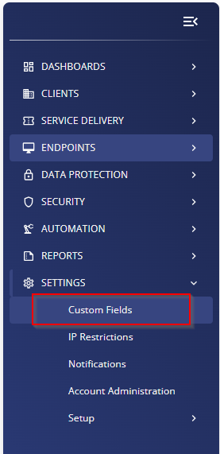
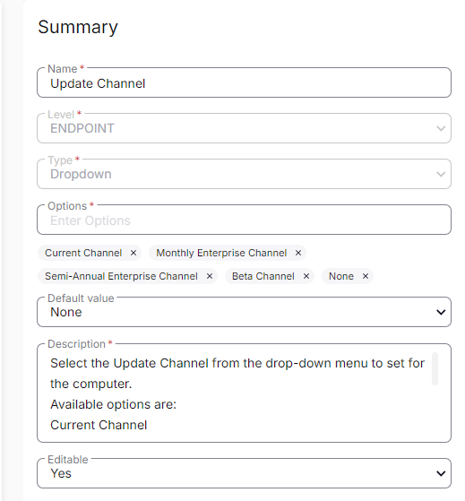

## Summary

Select the Update Channel from the drop-down menu to set for the computer. It is used by the [CW RMM - Task - Microsoft 365 - Click-to-Run - Set Update Channel](https://proval.itglue.com/DOC-5078775-17430050).

Available options are:  
- Current Channel  
- Monthly Enterprise Channel  
- Semi-Annual Enterprise Channel  
- Beta Channel  
- None  

## Dependencies

[CW RMM - Solution - Microsoft 365 - Click-to-Run - Set Update Channel](https://proval.itglue.com/DOC-5078775-17435723)

## Details

| Field Name         | Level    | Type       | Default Value | Description                                                                                                                                                                                                                   | Editable |
|--------------------|----------|------------|---------------|-------------------------------------------------------------------------------------------------------------------------------------------------------------------------------------------------------------------------------|----------|
| Update Channel      | ENDPOINT | Drop Down  | None          | Select the Update Channel from the drop-down menu to set for the computer. Available options are: Current Channel, Monthly Enterprise Channel, Semi-Annual Enterprise Channel, Beta Channel, None. Computer Level EDF can be used to override the value set in the Client Level EDF. | Yes      |

## Screenshots

  
  

