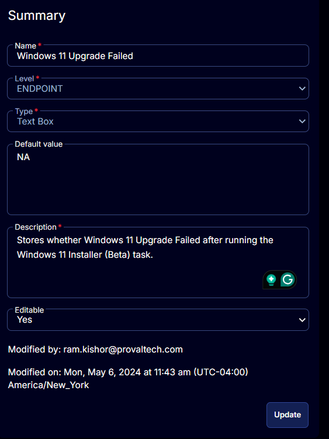

## Summary

Stores whether Windows 11 Upgrade Failed after running the Windows 11 Installer (Beta) task.

## Details

| Field Name                    | Level    | Type      | Default Value | Description                                                                 | Editable |
|-------------------------------|----------|-----------|---------------|-----------------------------------------------------------------------------|----------|
| Windows 11 Upgrade Failed      | Endpoint | Text Box  | NA            | Stores whether Windows 11 Upgrade Failed after running the Windows 11 Installer (Beta) task. | Yes      |

## Screenshot

  

